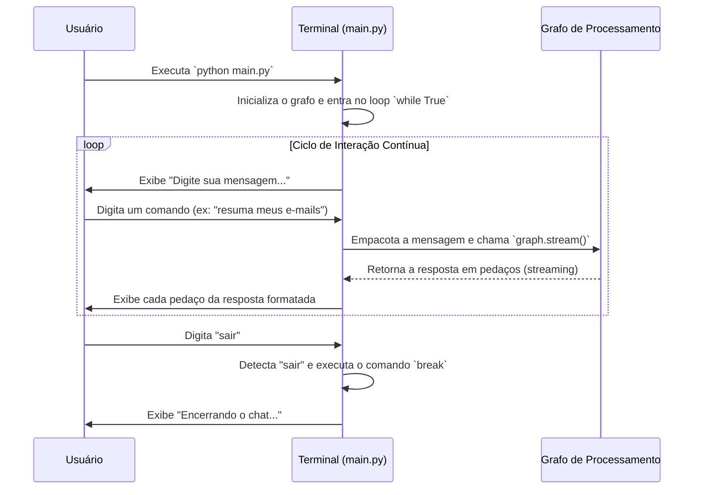

# Chapter 1: Ponto de Entrada e Ciclo de Interação


Bem-vindo ao nosso tutorial sobre a `Arcade Gmail Tool with Auth`! Neste primeiro capítulo, vamos começar pelo início de tudo: a "porta de entrada" da nossa aplicação. Pense neste capítulo como o tour pela sala de controle principal, onde você, o usuário, comanda todo o sistema.

Imagine que você entra em uma sala com um terminal de computador. Como você liga o programa? Como você conversa com ele? E como você o desliga de forma segura? É exatamente isso que vamos explorar. Vamos desvendar o arquivo `main.py`, que é o coração do nosso ciclo de interação.

### O Problema: Como Manter uma Conversa?

Uma aplicação de chat precisa fazer três coisas essenciais:
1.  **Iniciar:** Ligar e ficar pronta para receber comandos.
2.  **Ouvir e Responder:** Ficar esperando continuamente por sua mensagem, processá-la e mostrar uma resposta.
3.  **Encerrar:** Desligar de forma limpa quando você pedir.

A solução para isso é um "ciclo de interação", também conhecido como "loop de eventos". É um processo que se repete infinitamente até que uma condição específica seja atendida (como você digitar "sair").

### O Ponto de Entrada: `if __name__ == "__main__":`

Todo programa em Python precisa de um ponto de partida. No nosso caso, é este bloco de código especial no arquivo `main.py`.

```python
# main.py

# ... importações e outras definições ...

if __name__ == "__main__":
  # O programa começa a ser executado aqui!
  graph = get_graph()

  # ... o resto do nosso código de interação vai aqui ...
```

Pense no `if __name__ == "__main__":` como o botão "Ligar" da nossa aplicação. Quando você executa o comando `python main.py` no seu terminal, o Python procura por este bloco e começa a executar o que está dentro dele. A primeira coisa que fazemos é chamar `get_graph()`, que prepara todo o cérebro da nossa aplicação, o [Grafo de Fluxo de Trabalho](04_grafo_de_fluxo_de_trabalho_.md). Falaremos mais sobre o grafo em um capítulo futuro.

### O Ciclo de Interação: O Loop `while True`

Uma vez que a aplicação está "ligada", precisamos que ela fique rodando para que possamos conversar com ela. Para isso, usamos um loop infinito, o `while True`.

```python
# main.py

# ...

if __name__ == "__main__":
  graph = get_graph()

  # Loop para aguardar input do usuário
  while True:
    try:
      # Todo o nosso chat acontece aqui dentro!
      # ...
    except KeyboardInterrupt:
      print("\nPrograma interrompido pelo usuário.")
      break
```

O `while True` significa "faça o que está dentro deste bloco para sempre". Isso cria a nossa "sessão de chat". O bloco `try...except` é uma rede de segurança. Se algo inesperado acontecer, ou se você pressionar `Ctrl+C` (`KeyboardInterrupt`), o programa não quebra, mas encerra de forma controlada.

### Passo a Passo de uma Conversa

Dentro do nosso loop `while True`, cada repetição segue um padrão simples: pedir, ler, processar e responder.

#### 1. Pedir e Ler a Mensagem do Usuário

Primeiro, o programa avisa que está pronto e espera por sua mensagem.

```python
# Dentro do loop while True

print("\nDigite sua mensagem (ou 'sair' para encerrar): ")
user_input = input("> ")
```

-   `print(...)`: Mostra a mensagem "Digite sua mensagem..." na tela.
-   `input("> ")`: Pausa o programa e espera que você digite algo e pressione Enter. O que você digitar é armazenado na variável `user_input`.

#### 2. Verificar a Condição de Saída

A primeira coisa que fazemos com a sua mensagem é verificar se você quer encerrar o chat.

```python
# Dentro do loop while True

if user_input.lower() == 'sair':
  print("Encerrando o chat...")
  break
```

-   `user_input.lower()`: Converte sua mensagem para letras minúsculas. Assim, "Sair", "sair" ou "SAIR" funcionam da mesma forma.
-   `== 'sair'`: Compara o texto com a palavra "sair".
-   `break`: Se a condição for verdadeira, o comando `break` "quebra" o loop `while True` e o programa continua para a próxima linha após o loop, efetivamente encerrando o chat.

#### 3. Preparar a Mensagem para o "Cérebro"

Se você não digitou "sair", sua mensagem precisa ser enviada para ser processada. Não podemos simplesmente enviar o texto puro; precisamos empacotá-lo em um formato que o sistema entenda.

```python
# Dentro do loop while True

# Define as mensagens com o input do usuário
inputs = {
  "messages": [
    {
      "role": "user",
      "content": user_input,
    }
  ],
}

# Configuração com IDs de encadeamento e usuário para fins de autorização
config = {"configurable": {"thread_id": "123456", "user_id": "gabrielsilveira.web@gmail.com"}}
```

-   `inputs`: Pense nisto como um envelope. Colocamos sua mensagem (`user_input`) dentro dele, junto com uma etiqueta `role: "user"` para indicar que a mensagem veio de você.
-   `config`: Este é um envelope extra com informações importantes para o sistema, como um ID de conversa (`thread_id`) e seu ID de usuário (`user_id`). Isso será crucial para o [Mecanismo de Autorização](05_mecanismo_de_autorização_.md), que garante que a aplicação tem permissão para agir em seu nome.

#### 4. Enviar para Processamento e Exibir a Resposta

Com o "envelope" pronto, nós o enviamos para o nosso grafo de processamento e aguardamos a resposta.

```python
# Dentro do loop while True

# Executa o grafo e transmite as saídas.
for chunk in graph.stream(inputs, config=config, stream_mode="values"):
  # Imprime de forma bonita a última mensagem no chunk
  chunk["messages"][-1].pretty_print()
```

-   `graph.stream(...)`: Este é o comando principal! Ele envia sua mensagem para o [Grafo de Fluxo de Trabalho](04_grafo_de_fluxo_de_trabalho_.md). O `stream` significa que a resposta pode chegar em pedaços (chunks), como um vídeo do YouTube que carrega enquanto você assiste.
-   `for chunk in ...`: Este loop processa cada pedaço da resposta assim que ele chega.
-   `pretty_print()`: É uma função de ajuda para formatar e exibir a resposta no terminal de uma forma legível.

### Como Tudo se Conecta: Por Baixo dos Panos

Para visualizar o fluxo, vamos usar um diagrama. Ele mostra como o usuário, o terminal (nosso script `main.py`) e o "Grafo" (o cérebro da aplicação) interagem.



Este ciclo se repete incansavelmente, dando a sensação de uma conversa contínua e fluida, até que você decida terminá-la. O `main.py` atua como um maestro, garantindo que a sua mensagem chegue ao lugar certo e que a resposta volte para você.

### Conclusão

Parabéns! Você acabou de entender a espinha dorsal da nossa aplicação. Vimos como o `main.py` serve como ponto de entrada e como o ciclo `while True` cria uma sessão de chat interativa. Aprendemos como a entrada do usuário é capturada, empacotada, processada e como a resposta é exibida. Mais importante, agora você sabe como iniciar e parar a aplicação.

Este ciclo de interação é a base sobre a qual construiremos funcionalidades mais complexas. Agora que sabemos *como* a aplicação conversa, vamos ver *o que* ela pode fazer. No próximo capítulo, mergulharemos em uma das suas capacidades mais poderosas.

A seguir: [Capítulo 2: Ferramentas do Gmail (via Arcade)](02_ferramentas_do_gmail__via_arcade__.md)

---

Generated by [AI Codebase Knowledge Builder](https://github.com/The-Pocket/Tutorial-Codebase-Knowledge)