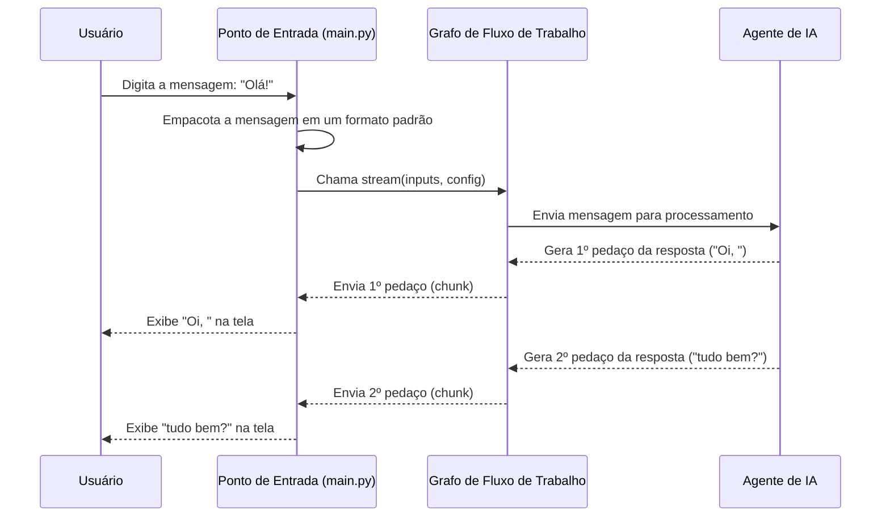

# Chapter 1: Ponto de Entrada e Interação com Usuário


Bem-vindo ao nosso primeiro capítulo! Aqui, vamos desvendar a porta de entrada do nosso chatbot, o lugar onde toda a mágica começa. Pense neste componente como a recepção de um prédio inteligente: é aqui que você chega, diz o que precisa, e o sistema começa a trabalhar para te atender.

Neste capítulo, vamos entender como o nosso programa fica esperando por uma mensagem sua, como ele a prepara para ser processada e como ele exibe a resposta de volta para você, criando a experiência de um chat de verdade.

## O Que é um Ponto de Entrada?

Imagine que você quer conversar com o nosso chatbot para saber o status do seu jogo favorito na plataforma Arcade. Onde você digita sua pergunta? Como o programa sabe que você digitou algo? E como ele mostra a resposta?

O "Ponto de Entrada" resolve exatamente isso. É a parte do código responsável por três tarefas principais:

1.  **Ouvir:** Ficar em um "loop" infinito, esperando pacientemente que você digite uma mensagem.
2.  **Empacotar:** Pegar a sua mensagem e colocá-la em um formato padrão, como preencher um formulário, para que as outras partes do sistema entendam.
3.  **Exibir:** Receber a resposta do sistema e mostrá-la na sua tela, pedaço por pedaço.

Sem essa parte, nosso chatbot seria como um cérebro brilhante trancado em uma sala sem portas nem janelas – ele poderia pensar, mas não conseguiria conversar com ninguém.

## Como Funciona na Prática?

Vamos dar uma olhada no coração do nosso arquivo `main.py`. Este é o script que você executa para iniciar o chatbot. Nós o dividimos em pequenas partes para facilitar o entendimento.

### 1. Preparando o Terreno e Iniciando a Conversa

Todo programa precisa de um ponto de partida. No nosso caso, é aqui que preparamos o "cérebro" do nosso chat e iniciamos um laço (loop) para que ele fique sempre pronto para conversar.

```python
# Arquivo: main.py

from src.graph import get_graph

if __name__ == "__main__":
  graph = get_graph()

  # Loop para aguardar input do usuário
  while True:
    # O resto do nosso código de chat acontece aqui dentro
    ...
```

**O que este código faz?**

*   `if __name__ == "__main__":`: Esta é uma convenção em Python que diz: "Comece a executar o código a partir daqui quando o arquivo for iniciado diretamente". É o ponto de partida oficial.
*   `graph = get_graph()`: Aqui, estamos "acordando" a parte principal do nosso sistema, o que chamamos de grafo. Pense nele como o gerente geral que sabe para qual departamento enviar sua solicitação. Vamos explorar o [Grafo de Fluxo de Trabalho (Workflow)](05_grafo_de_fluxo_de_trabalho__workflow__.md) em detalhes mais tarde.
*   `while True:`: Este comando cria um laço infinito. Ele garante que, após responder a uma pergunta, o programa não encerre, mas volte imediatamente a esperar pela sua próxima mensagem.

### 2. Ouvindo a Sua Mensagem

Dentro do nosso laço, a primeira coisa a fazer é esperar pela sua mensagem.

```python
# Arquivo: main.py (dentro do loop while)

try:
  print("\nDigite sua mensagem (ou 'sair' para encerrar): ")
  user_input = input("> ")
  
  if user_input.lower() == 'sair':
    print("Encerrando o chat...")
    break
```

**O que este código faz?**

*   `user_input = input("> ")`: Esta é a função mágica que pausa o programa e espera que você digite algo no teclado e pressione "Enter". O que você digitar será armazenado na variável `user_input`.
*   `if user_input.lower() == 'sair'`: Criamos uma "saída de emergência". Se você digitar "sair", o comando `break` interrompe o laço `while True:` e o programa se encerra de forma amigável.

### 3. Empacotando e Enviando a Mensagem

Depois de receber sua mensagem, não podemos simplesmente jogá-la para o sistema. Precisamos formatá-la corretamente, como se estivéssemos preenchendo um formulário padrão.

```python
# Arquivo: main.py (continuação dentro do loop)

# Define as mensagens com o input do usuário
inputs = {
  "messages": [
    {
      "role": "user",
      "content": user_input,
    }
  ],
}

# Configuração com IDs para fins de autorização e memória
config = {"configurable": {"thread_id": "123456", "user_id": "gabrielsilveira.web@gmail.com"}}

# Executa o grafo e transmite as saídas
for chunk in graph.stream(inputs, config=config, stream_mode="values"):
    # ... aqui vamos exibir a resposta ...
```

**O que este código faz?**

*   `inputs = { ... }`: Criamos um "pacote" (um dicionário Python) com a sua mensagem. Note a estrutura: `"role": "user"` diz ao sistema que esta mensagem veio de você, o usuário, e `"content": user_input` contém o texto que você digitou. Essa estrutura é fundamental para o [Agente de IA (O Cérebro)](02_agente_de_ia__o_cérebro__.md).
*   `config = { ... }`: Este é um pacote de informações extras. `thread_id` ajuda a manter o histórico da conversa (a [Memória da Conversa](03_memória_da_conversa___messagesstate__e__memorysaver___.md)), e `user_id` identifica quem está falando, o que é crucial para o nosso [Guardião de Autorização](07_guardião_de_autorização___authorize___.md).
*   `graph.stream(...)`: Este é o momento do envio! Estamos passando o pacote `inputs` e as configurações `config` para o nosso grafo. O método `.stream()` é especial: ele não espera a resposta inteira ficar pronta. Em vez disso, ele nos envia a resposta em pequenos pedaços (`chunks`), assim que eles são gerados.

### 4. Exibindo a Resposta

Conforme os pedaços da resposta chegam, nós os exibimos na tela. Isso cria aquele efeito de "digitação" que você vê em chatbots modernos.

```python
# Arquivo: main.py (dentro do loop for)

# Pretty-print da última mensagem no chunk
chunk["messages"][-1].pretty_print()
```

**O que este código faz?**

*   `for chunk in ...`: Este laço processa cada pedaço que o `graph.stream()` nos envia.
*   `chunk["messages"][-1]`: Cada `chunk` contém o estado atual da conversa. Estamos pegando a última mensagem (`[-1]`) da lista de mensagens.
*   `.pretty_print()`: É um método auxiliar que simplesmente formata e exibe o conteúdo da mensagem de forma legível no seu terminal.

## O Fluxo da Conversa

Para visualizar melhor, vamos ver o caminho que uma mensagem percorre desde o momento em que você a digita até receber a resposta.



Este diagrama mostra como o `Ponto de Entrada` atua como um intermediário crucial, orquestrando a comunicação entre você e o cérebro do sistema, o [Grafo de Fluxo de Trabalho (Workflow)](05_grafo_de_fluxo_de_trabalho__workflow__.md).

## Conclusão

Parabéns! Você acabou de entender a parte mais fundamental do nosso chatbot: a interface que o conecta com o mundo real. Vimos como o `main.py` atua como um recepcionista dedicado, que:

*   Aguarda pacientemente por suas instruções (`while True` e `input()`).
*   Organiza sua solicitação em um formato que o sistema entende.
*   Envia para o departamento correto (`graph.stream`).
*   E lê a resposta para você em tempo real.

Agora que entendemos como a conversa *começa* e *termina* do ponto de vista do usuário, estamos prontos para mergulhar na parte mais inteligente do nosso sistema.

No próximo capítulo, vamos conhecer quem realmente pensa e formula as respostas. Vamos para o [Capítulo 2: Agente de IA (O Cérebro)](02_agente_de_ia__o_cérebro__.md).

---

Generated by [AI Codebase Knowledge Builder](https://github.com/The-Pocket/Tutorial-Codebase-Knowledge)