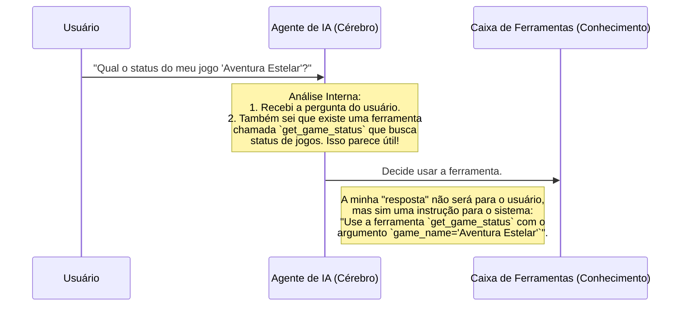

# Chapter 2: Agente de IA (O Cérebro)


No [Capítulo 1: Ponto de Entrada e Interação com Usuário](01_ponto_de_entrada_e_interação_com_usuário_.md), construímos a porta da frente do nosso chatbot. Aprendemos como ele recebe uma mensagem sua e exibe uma resposta. Mas quem exatamente está "pensando" nessa resposta?

Bem-vindo ao centro de comando, o cérebro do nosso sistema. Neste capítulo, vamos conhecer o **Agente de IA**. Pense nele como um gerente de projeto extremamente inteligente. Ele ouve sua solicitação, analisa os recursos que tem à disposição e decide o melhor curso de ação.

## O Que é um Agente de IA?

Imagine que você chega para seu gerente e pede: "Preciso do relatório de vendas do último trimestre". O gerente tem duas opções:

1.  Se ele tiver os números de cabeça, ele responde diretamente: "Foram R$ 50.000,00".
2.  Se ele não souber, ele não inventa uma resposta. Em vez disso, ele diz: "Vou pedir para a equipe de finanças buscar essa informação para mim". Ele delega a tarefa para um especialista.

Nosso Agente de IA funciona exatamente da mesma forma. Ele é um **Modelo de Linguagem Grande (LLM)**, como o GPT-4o da OpenAI, que foi treinado para entender e gerar texto. Sua principal função é analisar a sua mensagem e decidir o que fazer:

1.  **Responder Diretamente:** Se a pergunta for simples como "Olá, tudo bem?", o agente pode formular uma resposta por conta própria.
2.  **Usar uma Ferramenta:** Se a pergunta for "Qual o status do meu jogo 'Cavaleiros do Zodíaco' na plataforma Arcade?", o agente sabe que não tem essa informação em tempo real. No entanto, ele sabe que possui uma "ferramenta" que pode buscar essa informação. Então, sua decisão não é uma resposta, mas sim uma instrução: "Use a ferramenta `get_game_status` com o nome 'Cavaleiros do Zodíaco'".

Este processo de tomada de decisão é o que torna nosso chatbot inteligente e útil, em vez de apenas um repetidor de frases prontas.

## Como o Agente Ganha Seus "Poderes"

Um LLM, por si só, é apenas um cérebro que sabe conversar. Para que ele se torne um agente poderoso, precisamos "apresentar" a ele as ferramentas que ele pode usar. É como dar a um gerente uma lista de contatos dos departamentos da empresa.

Fazemos isso no arquivo `src/llm.py`.

```python
# Arquivo: src/llm.py

from langchain_openai import ChatOpenAI
from src.arcade import tools

# 1. Criamos uma instância do cérebro (o modelo de linguagem)
llm = ChatOpenAI(model="gpt-4o")

# 2. "Apresentamos" as ferramentas ao cérebro
llm_with_tools = llm.bind_tools(tools)
```

**O que este código faz?**

*   `llm = ChatOpenAI(model="gpt-4o")`: Aqui, estamos inicializando nosso cérebro. Estamos dizendo: "Vamos usar o modelo `gpt-4o` da OpenAI como nossa base de inteligência".
*   `from src.arcade import tools`: Estamos importando a lista de todas as ferramentas disponíveis da Arcade, que vamos explorar em detalhes no [Capítulo 4: Caixa de Ferramentas (Integração Arcade)](04_caixa_de_ferramentas__integração_arcade__.md).
*   `llm_with_tools = llm.bind_tools(tools)`: Esta é a linha mais importante! O método `.bind_tools()` "conecta" o cérebro (LLM) às ferramentas. A partir de agora, toda vez que o LLM receber uma pergunta, ele também considerará: "Será que alguma dessas ferramentas pode me ajudar a responder melhor?".

## Invocando o Cérebro

Agora que nosso agente está ciente das ferramentas, como o fazemos pensar? Isso acontece dentro da função `call_agent` no arquivo `src/agents.py`.

```python
# Arquivo: src/agents.py

from src.llm import llm_with_tools

# Função para invocar o modelo de linguagem e obter uma resposta
def call_agent(state):
    # 1. Pega o histórico da conversa
    messages = state["messages"]
    
    # 2. Envia a conversa para o agente e aguarda a decisão
    response = llm_with_tools.invoke(messages)

    # 3. Retorna a decisão para ser adicionada ao histórico
    return {"messages": [response]}
```

**O que este código faz?**

1.  `messages = state["messages"]`: A função recebe o `state`, que é o estado atual da nossa conversa. Nós pegamos a lista de todas as mensagens trocadas até agora. A forma como essa memória funciona será o tópico do nosso próximo capítulo, [Memória da Conversa (`MessagesState` e `MemorySaver`)](03_memória_da_conversa___messagesstate__e__memorysaver___.md).
2.  `response = llm_with_tools.invoke(messages)`: Este é o momento da "mágica". Estamos chamando (`invoke`) nosso agente (o `llm_with_tools`) e passando todo o histórico da conversa para ele. O agente analisa tudo e gera uma `response`.
3.  `return {"messages": [response]}`: A `response` não é apenas um texto simples. É um objeto estruturado que contém a decisão do agente. Nós o retornamos para que ele seja adicionado ao histórico da conversa.

## Por Dentro da Mente do Agente

Vamos visualizar o processo de pensamento do agente com um diagrama.



Este é o ponto crucial: **a saída do agente nem sempre é uma resposta final para o usuário**. Muitas vezes, é uma etapa intermediária, uma instrução para outra parte do sistema.

### Como a "Resposta" do Agente se Parece?

Vamos comparar dois cenários para entender a estrutura da `response` que a função `call_agent` recebe.

**Cenário 1: Resposta Simples**

*   **Sua mensagem:** `"Oi!"`
*   **A `response` do agente (simplificada) será algo como:**
    *   **Tipo:** Mensagem de IA
    *   **Conteúdo:** `"Olá! Como posso te ajudar hoje?"`
    *   **Chamadas de Ferramenta:** Nenhuma

**Cenário 2: Decisão de Usar uma Ferramenta**

*   **Sua mensagem:** `"Qual o status do meu jogo 'Aventura Estelar'?"`
*   **A `response` do agente (simplificada) será algo como:**
    *   **Tipo:** Mensagem de IA
    *   **Conteúdo:** `""` (vazio, porque a resposta final virá da ferramenta)
    *   **Chamadas de Ferramenta:** `[{ "name": "get_game_status", "args": { "game_name": "Aventura Estelar" } }]`

Veja a diferença? No segundo caso, o agente não tentou adivinhar o status do jogo. Ele emitiu uma ordem clara para que o sistema use a ferramenta `get_game_status`. As outras partes do nosso chatbot, como o [Roteador de Decisões (`should_continue`)](06_roteador_de_decisões___should_continue___.md), irão ver essa "chamada de ferramenta" e agir de acordo.

## Conclusão

Neste capítulo, abrimos o capô e olhamos para o motor do nosso chatbot: o **Agente de IA**. Aprendemos que ele é muito mais do que um simples gerador de texto. Ele é um tomador de decisões que:

*   É construído sobre um poderoso Modelo de Linguagem (LLM).
*   É "armado" com um conjunto de ferramentas especializadas usando `bind_tools`.
*   Analisa o contexto da conversa e decide entre responder diretamente ou delegar a tarefa a uma ferramenta.
*   Comunica sua decisão através de uma resposta estruturada, que pode conter uma instrução para chamar uma ferramenta.

Agora que nosso agente pode pensar, surge uma nova pergunta: como ele se *lembra* do que conversamos antes? Para uma conversa fluida, ele precisa de memória.

No próximo capítulo, vamos construir a memória do nosso chatbot. Vamos para o [Capítulo 3: Memória da Conversa (`MessagesState` e `MemorySaver`)](03_memória_da_conversa___messagesstate__e__memorysaver___.md).

---

Generated by [AI Codebase Knowledge Builder](https://github.com/The-Pocket/Tutorial-Codebase-Knowledge)