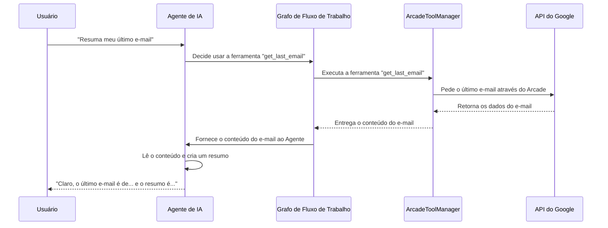

# Chapter 2: Ferramentas do Gmail (via Arcade)


No [capítulo anterior](01_ponto_de_entrada_e_ciclo_de_interação_.md), estabelecemos a base da nossa aplicação: o ciclo de conversa que nos permite interagir com o sistema. Aprendemos como a aplicação nos ouve e nos responde. Agora, é hora de dar um passo adiante e descobrir *o que* ela realmente pode fazer. Como ela realiza tarefas práticas, como ler ou resumir seus e-mails?

Bem-vindo ao mundo das "Ferramentas". Neste capítulo, vamos equipar nossa aplicação com um conjunto de habilidades poderosas para interagir com o Gmail.

### O Problema: Como Dar Superpoderes à Nossa Aplicação?

Imagine que nosso programa é um gerente de projetos muito inteligente, mas que não sabe como realizar tarefas do mundo real. Ele pode entender o que você pede ("resuma meu último e-mail sobre o projeto X"), mas não tem as "mãos" para abrir o Gmail, encontrar o e-mail e lê-lo.

Poderíamos construir essas "mãos" do zero, escrevendo código complexo para se conectar à API do Google, lidar com autenticação e processar os dados. No entanto, isso é difícil, demorado e frágil. E se quiséssemos adicionar ferramentas para o Slack ou o Notion depois? Teríamos que começar tudo de novo.

### A Solução: Uma Caixa de Ferramentas Universal Chamada Arcade

É aqui que entra o **Arcade**. Pense no Arcade como uma loja de ferramentas universal e um adaptador mágico. Em vez de construirmos cada ferramenta (uma chave de fenda para o Gmail, um martelo para o Slack), o Arcade nos fornece uma caixa de ferramentas pronta para usar.

- **Ferramentas Prontas:** O Arcade oferece um conjunto de habilidades pré-construídas, como `ler_emails`, `resumir_emails`, e `enviar_email`.
- **Adaptador Universal:** Ele cuida de toda a complexidade de se conectar com serviços como o Google. Nós simplesmente pedimos ao Arcade "use a ferramenta de ler e-mails", e ele faz todo o trabalho pesado por nós.

Isso torna nosso código incrivelmente simples e fácil de manter. Damos ao nosso gerente de projetos (o [Agente de IA](03_agente_de_ia_.md)) acesso a essa caixa de ferramentas, e ele só precisa aprender a escolher a ferramenta certa para o trabalho.

### Preparando Nossa Caixa de Ferramentas: O Arquivo `src/tools.py`

O primeiro passo é configurar nossa caixa de ferramentas. Fazemos isso no arquivo `src/tools.py`. O código é surpreendentemente curto, graças ao Arcade.

```python
# src/tools.py

from langchain_arcade import ArcadeToolManager
from langgraph.prebuilt import ToolNode
from src.config import ARCADE_API_KEY

# Inicializa o gerente de ferramentas e busca as ferramentas compatíveis com o langgraph
tool_manager = ArcadeToolManager(api_key=ARCADE_API_KEY)
tools = tool_manager.get_tools(toolkits=["Google"])
tool_node = ToolNode(tools)
```

Vamos quebrar esse código em três passos simples:

1.  **Contratar o Gerente da Caixa de Ferramentas (`ArcadeToolManager`)**

    ```python
    tool_manager = ArcadeToolManager(api_key=ARCADE_API_KEY)
    ```

    Aqui, criamos uma instância do `ArcadeToolManager`. Pense nisso como contratar um gerente especializado em ferramentas. Nós damos a ele uma "chave mestra" (`ARCADE_API_KEY`) que lhe dá acesso ao vasto depósito de ferramentas do Arcade.

2.  **Selecionar as Ferramentas Necessárias (`get_tools`)**

    ```python
    tools = tool_manager.get_tools(toolkits=["Google"])
    ```

    Agora, dizemos ao nosso gerente: "Vá ao depósito e traga-me a caixa de ferramentas do 'Google'". O `tool_manager` então nos entrega uma lista de todas as ferramentas disponíveis para interagir com os serviços do Google (Gmail, Google Calendar, etc.). Essas ferramentas são agora armazenadas na variável `tools`.

3.  **Preparar as Ferramentas para o Trabalho (`ToolNode`)**

    ```python
    tool_node = ToolNode(tools)
    ```

    Nossa aplicação principal usa um sistema chamado [Grafo de Fluxo de Trabalho](04_grafo_de_fluxo_de_trabalho_.md) para organizar suas tarefas. Este grafo não entende as ferramentas diretamente. O `ToolNode` atua como um invólucro ou um "carrinho de ferramentas" especial. Ele organiza as ferramentas de uma forma que o nosso grafo consegue entender e utilizar facilmente.

E é isso! Com apenas três linhas de código, nossa aplicação agora tem acesso a um conjunto poderoso de ferramentas do Gmail, prontas para serem usadas.

### Por Baixo dos Panos: Como uma Ferramenta é Usada?

Ok, temos as ferramentas. Mas como a aplicação as usa quando você digita um comando como "Resuma o último e-mail que recebi"?

O processo envolve uma colaboração entre o nosso [Agente de IA](03_agente_de_ia_.md) e o `ArcadeToolManager`.

Vamos visualizar o fluxo com um diagrama:



**Passo a passo:**
1.  **Você dá um comando:** Você pede ao agente para resumir seu último e-mail.
2.  **O Agente Decide:** O [Agente de IA](03_agente_de_ia_.md) analisa seu pedido e percebe que, para cumpri-lo, ele precisa da ferramenta `get_last_email`.
3.  **O Grafo Executa:** O agente informa ao [Grafo de Fluxo de Trabalho](04_grafo_de_fluxo_de_trabalho_.md) qual ferramenta usar. O grafo, por sua vez, usa o `ToolNode` (nosso carrinho de ferramentas) para chamar o `ArcadeToolManager`.
4.  **O Arcade Faz a Mágica:** O `ArcadeToolManager` assume o controle. Ele se conecta de forma segura à API do Google, busca a informação solicitada (o último e-mail) e a retorna.
5.  **A Resposta Volta:** O conteúdo do e-mail viaja de volta pelo mesmo caminho até o agente.
6.  **O Agente Finaliza:** Com o conteúdo do e-mail em mãos, o agente pode finalmente realizar a tarefa de resumir e apresentar a resposta para você.

### Um Olhar Rápido em Como as Ferramentas se Conectam

Embora a gente vá mergulhar mais fundo no [Agente de IA](03_agente_de_ia_.md) e no [Mecanismo de Autorização](05_mecanismo_de_autorização_.md) nos próximos capítulos, é útil ver um trecho de código de `src/agents.py` para entender como o sistema decide quando usar uma ferramenta.

```python
# src/agents.py

# ... outras partes do código ...

# Essa função inspeciona a resposta do agente e decide o próximo passo.
def should_continue(state: MessagesState):
    # Pega a última mensagem e verifica se o agente decidiu usar uma ferramenta
    if state["messages"][-1].tool_calls:
        for tool_call in state["messages"][-1].tool_calls:
            # Verifica se a ferramenta precisa de autorização
            if tool_manager.requires_auth(tool_call["name"]):
                return "authorization" # Precisa de permissão!
        return "tools"  # Prossiga para a execução da ferramenta
    return END  # Termine se nenhuma ferramenta for necessária
```

Esta função, `should_continue`, age como um sinaleiro de trânsito. Depois que o agente analisa sua mensagem, esta função verifica a resposta dele:

-   **"Ele decidiu usar uma ferramenta?"** (`if state["messages"][-1].tool_calls`).
-   Se sim, **"Essa ferramenta precisa de uma permissão especial?"** (`if tool_manager.requires_auth(...)`). Por exemplo, ler seus e-mails privados exige sua autorização explícita.
-   Com base nessas respostas, o sinaleiro direciona o fluxo: ou para o [Mecanismo de Autorização](05_mecanismo_de_autorização_.md), ou diretamente para a execução da ferramenta, ou encerra o processo se nenhuma ação for necessária.

### Conclusão

Parabéns! Você acabou de equipar nossa aplicação com superpoderes. Vimos como o Arcade atua como uma caixa de ferramentas universal, nos poupando do trabalho pesado de integrar APIs. Entendemos como o `ArcadeToolManager` busca e prepara as ferramentas do Gmail no arquivo `src/tools.py`.

Agora que nossa aplicação tem tanto um ciclo de conversa quanto um conjunto de habilidades, falta uma peça crucial no quebra-cabeça: o "cérebro" que decide *quando* e *como* usar essas ferramentas.

A seguir: [Capítulo 3: Agente de IA](03_agente_de_ia_.md)

---

Generated by [AI Codebase Knowledge Builder](https://github.com/The-Pocket/Tutorial-Codebase-Knowledge)