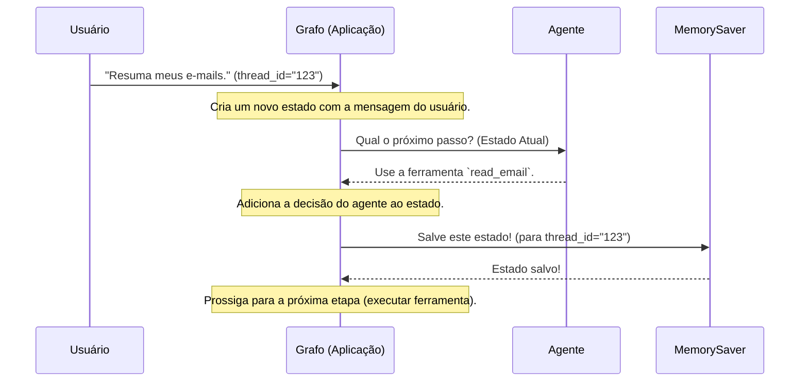

# Chapter 2: Gerenciamento de Estado da Conversa


No [Capítulo 1: Agente Inteligente](01_agente_inteligente_.md), conhecemos o cérebro da nossa aplicação: o agente que entende nossos pedidos e decide qual ferramenta usar. Mas uma conversa inteligente é mais do que apenas uma única pergunta e resposta.

Imagine este diálogo:
1.  **Você:** "Qual foi o último e-mail que recebi?"
2.  **Assistente:** "Foi um e-mail da Ana sobre o 'Relatório Trimestral'."
3.  **Você:** "Ok, resuma-o para mim."

Como o assistente sabe a qual e-mail "o" se refere? Ele precisa se *lembrar* da primeira parte da conversa. Essa "memória" é o que chamamos de **Estado da Conversa**.

Neste capítulo, vamos explorar como nossa aplicação mantém um registro de tudo o que foi dito, garantindo que o agente sempre tenha o contexto completo para tomar a decisão certa.

## O Bloco de Anotações da Conversa

Pense no gerenciamento de estado como um **bloco de anotações compartilhado**. Cada vez que alguém "fala" — seja você (o usuário), o agente ou uma ferramenta — uma nova anotação é adicionada a esse bloco.

-   **Usuário diz:** "Resuma meus 3 últimos e-mails." (Anotado!)
-   **Agente decide:** "Preciso usar a ferramenta `google_gmail_read_email`." (Anotado!)
-   **Ferramenta responde:** "Aqui estão os 3 e-mails." (Anotado!)
-   **Agente decide:** "Agora, preciso resumir este texto." (Anotado!)

Antes de tomar qualquer nova decisão, o agente lê o bloco de anotações inteiro. Isso garante que ele nunca perca o fio da meada.

No nosso código, esse "bloco de anotações" é representado por uma estrutura chamada `MessagesState`. É um objeto simples que, em sua essência, contém uma lista de todas as mensagens trocadas.

```python
# MessagesState é como um dicionário com uma chave "messages"
# que guarda uma lista de todas as interações.

# Exemplo de como o estado poderia parecer no meio de uma conversa:
estado_da_conversa = {
  "messages": [
    {"role": "user", "content": "Resuma meus 3 últimos e-mails."},
    {"role": "assistant", "tool_calls": [...]}, # Decisão do agente de usar uma ferramenta
    {"role": "tool", "content": "..."} # Resultado da execução da ferramenta
  ]
}
```

Cada passo no nosso fluxo de trabalho recebe este estado completo, lê o que precisa e adiciona novas mensagens a ele.

## Tornando a Memória Permanente com `MemorySaver`

Ter um bloco de anotações na memória do computador é ótimo, mas o que acontece se o programa for reiniciado? A memória se perde. Para resolver isso, usamos um componente chamado `MemorySaver`.

O `MemorySaver` age como um "salvamento automático" para nosso bloco de anotações. A cada passo da conversa, ele tira uma "foto" (um *checkpoint*) do estado atual e a guarda em um local seguro.

Isso nos dá duas vantagens incríveis:
1.  **Resiliência:** Se algo der errado, podemos retomar exatamente de onde paramos.
2.  **Continuidade:** Podemos encerrar uma conversa hoje e continuá-la amanhã, e o agente terá a memória completa de tudo o que foi discutido anteriormente.

No nosso código, configurar essa memória persistente é muito simples.

```python
# Arquivo: main.py

from langgraph.checkpoint.memory import MemorySaver

# 1. Criamos uma instância do nosso "salvador de memória"
memory = MemorySaver()
```

Este código cria um objeto `memory` que sabe como salvar e carregar o estado da nossa conversa.

Em seguida, conectamos este "salvador" ao nosso fluxo de trabalho quando o compilamos.

```python
# Arquivo: main.py

# ... (código que define o workflow) ...

# 2. Compilamos o grafo, informando-o para usar nosso "salvador de memória"
graph = workflow.compile(checkpointer=memory)
```

E é isso! Com essas duas linhas, nosso fluxo de trabalho agora salva automaticamente seu estado após cada etapa. A complexidade de salvar e carregar a conversa é totalmente gerenciada para nós.

## Como Tudo Funciona nos Bastidores

Vamos visualizar o processo passo a passo para entender como o estado e a memória trabalham juntos. Imagine que você está iniciando uma nova conversa.



1.  **Início da Conversa:** Você envia uma mensagem. Nossa aplicação (`Grafo`) associa essa conversa a um identificador único, o `thread_id` (por exemplo, "123"). Isso é como dar um nome ao arquivo do nosso bloco de anotações.
2.  **Chamada ao Agente:** O `Grafo` envia o estado atual (contendo apenas a sua mensagem) para o [Agente Inteligente](01_agente_inteligente_.md).
3.  **Decisão do Agente:** O agente responde com sua decisão (por exemplo, "usar uma ferramenta").
4.  **Atualização do Estado:** O `Grafo` adiciona a resposta do agente à lista de mensagens no estado.
5.  **Checkpoint (Salvamento):** Antes de prosseguir, o `Grafo` pede ao `MemorySaver` para salvar o estado atual, associando-o ao `thread_id` "123".
6.  **Continuação:** O processo continua. Após a ferramenta ser executada, seu resultado também será adicionado ao estado, e um novo checkpoint será salvo.

### A Chave para Retomar Conversas: `thread_id`

A "mágica" para continuar uma conversa anterior está no `thread_id`. Quando executamos nosso grafo, passamos um objeto de configuração que contém esse identificador.

```python
# Arquivo: main.py

# A configuração diz ao grafo qual "conversa" estamos manipulando
config = {"configurable": {"thread_id": "123456"}}

# Ao executar, o MemorySaver primeiro verifica:
# "Já existe um estado salvo para o thread_id '123456'?"
# Se sim, ele carrega esse estado antes de começar.
for chunk in graph.stream(inputs, config=config, stream_mode="values"):
  # ...
```

-   Se o `MemorySaver` **não encontrar** um estado salvo para `"123456"`, ele inicia uma nova conversa.
-   Se ele **encontrar** um estado, ele o carrega na memória. A conversa continua exatamente de onde parou, com todo o histórico preservado.

Isso significa que cada `thread_id` representa uma conversa contínua e independente.

### O Estado em Ação nas Funções do Fluxo

Cada função que define um passo no nosso fluxo de trabalho (como `call_agent`) é projetada para receber o estado atual como seu primeiro argumento.

```python
# Arquivo: src/flow.py

from langgraph.graph import MessagesState

# A função recebe o estado completo da conversa
def call_agent(state: MessagesState):
    # Ela lê todo o histórico de mensagens para ter contexto
    messages = state["messages"]

    # O agente usa esse histórico para decidir o próximo passo
    response = model_with_tools.invoke(messages)

    # A função retorna a nova mensagem para ser adicionada ao estado
    return {"messages": [response]}
```

Repare como `call_agent` não recebe apenas a última mensagem, mas o objeto `state` inteiro. É por isso que o agente pode entender pronomes como "o" ou "ele" — ele tem acesso a todo o diálogo anterior em `state["messages"]`. Esta estrutura consistente é o que une todo o nosso sistema, um conceito que exploraremos mais a fundo no próximo capítulo.

## Conclusão

Neste capítulo, desvendamos o segredo por trás da memória da nossa aplicação. Aprendemos que:

-   O **Estado da Conversa** (`MessagesState`) é a memória de curto prazo, funcionando como um bloco de anotações que registra cada mensagem trocada.
-   Ele é passado para cada etapa do nosso fluxo, garantindo que o agente e as ferramentas sempre tenham o **contexto completo**.
-   O `MemorySaver` atua como a memória de longo prazo, salvando o estado a cada passo, o que nos permite **pausar e retomar conversas**.
-   O `thread_id` é a chave que identifica uma conversa específica, permitindo que o `MemorySaver` saiba qual histórico carregar.

Agora que entendemos o cérebro (o agente) e a memória (o estado), a próxima pergunta é: como organizamos os passos? Como definimos a sequência de "chamar o agente", "chamar as ferramentas" e "rotear as decisões"?

Isso nos leva ao esqueleto da nossa aplicação. No próximo capítulo, vamos construir o mapa que conecta todos esses componentes.

Vamos para o [Capítulo 3: Grafo de Fluxo de Trabalho](03_grafo_de_fluxo_de_trabalho_.md).

---

Generated by [AI Codebase Knowledge Builder](https://github.com/The-Pocket/Tutorial-Codebase-Knowledge)