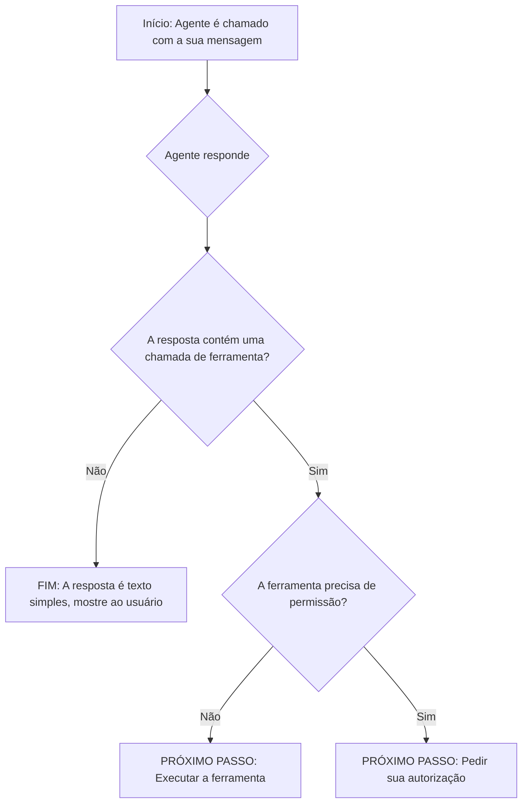
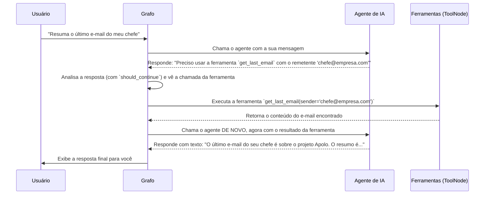

# Chapter 3: Agente de IA


Nos capítulos anteriores, montamos as fundações da nossa aplicação. Primeiro, criamos o [Ponto de Entrada e Ciclo de Interação](01_ponto_de_entrada_e_ciclo_de_interação_.md) que nos permite conversar com o sistema. Depois, no [Capítulo 2: Ferramentas do Gmail (via Arcade)](02_ferramentas_do_gmail__via_arcade__.md), equipamos nossa aplicação com uma poderosa caixa de ferramentas para interagir com o Gmail.

Agora, temos uma conversa e temos ferramentas. Mas falta a peça mais importante: o cérebro. Quem decide qual ferramenta usar e quando? Quem entende o que você realmente quer dizer com "resuma meus e-mails de hoje"?

Bem-vindo ao centro nevrálgico da nossa aplicação: o **Agente de IA**.

### O Problema: Como Transformar um Pedido em uma Ação?

Imagine que você é o chefe de uma oficina. Você tem um assistente e uma parede cheia de ferramentas. Se você diz "o carro do Sr. Silva está fazendo um barulho estranho, conserte", você não espera que seu assistente pegue um martelo e bata no motor aleatoriamente. Você espera que ele:

1.  **Ouça e entenda** o problema ("barulho estranho").
2.  **Diagnostique** a causa provável.
3.  **Planeje uma ação**, selecionando as ferramentas certas (uma chave de fenda, um estetoscópio de mecânico, etc.).
4.  **Execute** o plano.

Em nossa aplicação, o Agente de IA é esse assistente inteligente. Ele não é apenas um chatbot que repete palavras; é um "motor de raciocínio". Seu trabalho é pegar seu pedido em linguagem natural e traduzi-lo em um plano de ação concreto, decidindo se precisa usar uma de nossas [Ferramentas do Gmail (via Arcade)](02_ferramentas_do_gmail__via_arcade__.md) ou se pode responder diretamente.

### A Solução: Um Cérebro Potente com Acesso a Ferramentas

A solução é usar um Modelo de Linguagem Grande (LLM), como o GPT-4 da OpenAI, mas com uma instrução especial. Em vez de apenas pedir para ele conversar, nós o "vinculamos" (bind) às nossas ferramentas.

Isso é como dar ao seu assistente um manual detalhado de cada ferramenta na oficina. Agora, quando ele ouve um pedido, ele não apenas entende o português, mas também consulta seu manual interno para ver qual ferramenta é a mais adequada para a tarefa.

Vamos ver como damos esse "manual" para o nosso cérebro de IA no arquivo `src/llm.py`.

```python
# src/llm.py

from langchain_openai import ChatOpenAI
from src.tools import tools

# Cria uma instância do modelo de linguagem
llm = ChatOpenAI(model="gpt-4o")

# Vincula o modelo com as ferramentas disponíveis
llm_with_tools = llm.bind_tools(tools)
```

Vamos analisar este código, que é o coração do nosso agente:

1.  **`llm = ChatOpenAI(model="gpt-4o")`**: Aqui, estamos escolhendo o nosso "cérebro". Selecionamos o `gpt-4o`, um modelo de linguagem poderoso e conhecido. Pense nisso como contratar o assistente mais inteligente que pudemos encontrar.
2.  **`llm_with_tools = llm.bind_tools(tools)`**: Esta é a linha mágica. O comando `bind_tools` pega nosso cérebro de IA (`llm`) e o conecta diretamente com a nossa lista de `tools` (que preparamos no capítulo anterior). Agora, o `llm_with_tools` não é mais um modelo de linguagem genérico; ele se tornou um **agente especializado** que sabe exatamente quais são suas capacidades (ler, resumir, enviar e-mails, etc.) e como solicitar seu uso.

### Colocando o Agente para Trabalhar

Agora que temos nosso agente especializado, como o usamos? Dentro do nosso fluxo de trabalho, temos uma função específica para "chamar o agente" e pedir sua opinião.

Veja a função `call_agent` no arquivo `src/agents.py`:

```python
# src/agents.py

from src.llm import llm_with_tools
# ... outros imports ...

# Função para invocar o modelo de linguagem e obter uma resposta
def call_agent(state: MessagesState):
    messages = state["messages"]
    response = llm_with_tools.invoke(messages)

    # Retorna o histórico atualizado de mensagens
    return {"messages": [response]}
```

É bem simples:
- A função recebe o estado atual da conversa (`state`), que inclui todas as mensagens trocadas até agora.
- Ela pega essas `messages` e as envia para o nosso agente com o comando `llm_with_tools.invoke(messages)`.
- O `response` que recebemos não é apenas texto. É um objeto de mensagem especial que pode conter duas coisas:
    - Uma resposta em texto (se o agente decidiu responder diretamente).
    - Uma instrução para usar uma ferramenta (se ele achou que uma ação era necessária).

### A Lógica da Decisão: O Sinaleiro do Fluxo

O agente deu sua resposta. E agora? Como o sistema sabe se deve mostrar um texto, usar uma ferramenta ou pedir permissão?

É aqui que entra a função `should_continue`, que atua como um sinaleiro de trânsito. Ela inspeciona a resposta do agente e direciona o fluxo de trabalho para o caminho certo.



Este diagrama mostra a lógica de decisão. Agora vamos ver o código que implementa isso em `src/agents.py`:

```python
# src/agents.py

# ...

# Essa função inspeciona a resposta do agente e decide o próximo passo.
def should_continue(state: MessagesState):
    # Pega a última mensagem (a resposta do agente)
    last_message = state["messages"][-1]

    # O agente decidiu usar uma ferramenta?
    if last_message.tool_calls:
        # Sim, ele quer usar uma ferramenta. Qual delas?
        for tool_call in last_message.tool_calls:
            # Essa ferramenta precisa de autorização?
            if tool_manager.requires_auth(tool_call["name"]):
                return "authorization"  # Direcione para o fluxo de autorização
        return "tools"  # Se não precisa, direcione para a execução da ferramenta
    
    return END  # Se não, a tarefa deste turno acabou.
```

Esta função é a inteligência que guia nosso [Grafo de Fluxo de Trabalho](04_grafo_de_fluxo_de_trabalho_.md). Ela analisa a resposta do agente passo a passo:
1.  Ela olha a última mensagem, que é a que o agente acabou de gerar.
2.  Verifica se essa mensagem tem um atributo `.tool_calls`. Se tiver, significa que o agente não respondeu com texto, mas com uma instrução do tipo: "Use a ferramenta `summarize_emails` com os parâmetros X e Y".
3.  Se uma ferramenta foi chamada, ela verifica com o `tool_manager` (do Arcade) se essa ferramenta específica mexe com dados sensíveis e precisa de permissão (`requires_auth`).
4.  Finalmente, ela retorna uma "palavra-chave" (`"authorization"`, `"tools"`, ou `END`) que diz ao grafo qual é o próximo passo.

### Um Exemplo Completo: Por Baixo dos Panos

Vamos juntar tudo. Imagine que você digita: **"Resuma o último e-mail do meu chefe"**. Veja o que acontece nos bastidores:



Note o ciclo de dois passos:
1.  **Agente → Ferramenta**: O agente primeiro entende o pedido e decide qual ferramenta usar.
2.  **Ferramenta → Agente**: Depois que a ferramenta busca a informação bruta (o conteúdo do e-mail), essa informação é entregue de volta ao agente para que ele possa realizar a tarefa final (resumir) e formular uma resposta amigável em português.

### Conclusão

Parabéns! Você acabou de conhecer o cérebro da nossa operação. Vimos que o **Agente de IA** é muito mais do que um chatbot: é um motor de raciocínio que entende seus objetivos e cria um plano de ação.

Aprendemos como "ensinar" o agente sobre nossas ferramentas usando `llm.bind_tools` e como a função `should_continue` age como um sinaleiro, interpretando as decisões do agente para guiar o fluxo de trabalho. Esse ciclo de "pensar, agir, observar, pensar de novo" é o que torna os agentes de IA tão poderosos.

Agora que entendemos as peças individuais — a Conversa, as Ferramentas e o Agente — como elas são orquestradas para trabalhar juntas de forma harmoniosa? É hora de conhecer o maestro que rege toda essa orquestra.

A seguir: [Capítulo 4: Grafo de Fluxo de Trabalho](04_grafo_de_fluxo_de_trabalho_.md)

---

Generated by [AI Codebase Knowledge Builder](https://github.com/The-Pocket/Tutorial-Codebase-Knowledge)