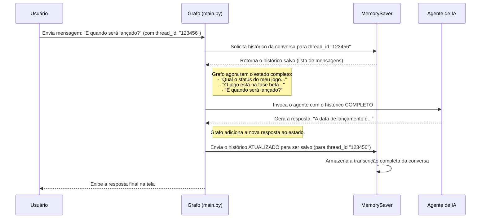

# Chapter 3: Memória da Conversa (`MessagesState` e `MemorySaver`)


No [Capítulo 2: Agente de IA (O Cérebro)](02_agente_de_ia__o_cérebro__.md), conhecemos a mente do nosso chatbot — o agente que pensa e toma decisões. Mas, para ter uma conversa de verdade, não basta apenas pensar; é preciso lembrar.

Imagine conversar com alguém que, a cada frase sua, esquece completamente tudo o que foi dito antes. Seria impossível manter um diálogo! Este capítulo é dedicado a resolver exatamente esse problema. Vamos construir a memória de curto prazo do nosso chatbot, garantindo que ele se lembre do contexto da conversa para dar respostas coerentes e inteligentes.

## O Que é a Memória da Conversa?

Pense na memória da conversa como uma transcrição de tudo o que foi dito entre você e o chatbot. Antes de formular qualquer nova resposta, o [Agente de IA (O Cérebro)](02_agente_de_ia__o_cérebro__.md) lê essa transcrição para entender o contexto completo.

Vamos ver um exemplo prático:

1.  **Você:** "Qual o status do meu jogo 'Aventura nas Estrelas'?"
2.  **Chatbot:** "O jogo 'Aventura nas Estrelas' está atualmente na fase de testes beta."
3.  **Você:** "E quando será lançado?"

Sem memória, o agente receberia a pergunta "E quando será lançado?" sem nenhum contexto. Lançado o quê? O mundo? Um foguete? Ele não saberia responder.

Com memória, o agente lê o histórico completo:
*   `Usuário: "Qual o status do meu jogo 'Aventura nas Estrelas'?"`
*   `IA: "O jogo 'Aventura nas Estrelas' está atualmente na fase de testes beta."`
*   `Usuário: "E quando será lançado?"`

Agora, o agente entende perfeitamente que "ele" se refere ao jogo "Aventura nas Estrelas" e pode buscar a data de lançamento específica para esse jogo.

Para implementar essa memória, usamos dois componentes principais da biblioteca `LangGraph`: `MessagesState` e `MemorySaver`.

### 1. `MessagesState`: A Estrutura da Memória

O `MessagesState` é como um modelo ou um formulário que define **como** nossa memória será organizada. Ele não guarda os dados, mas estabelece o formato deles. No nosso caso, definimos que a memória do nosso chatbot será uma simples lista de mensagens.

Pense nele como o design de um diário: cada página terá um campo para "Quem falou" (o papel) e "O que foi dito" (o conteúdo).

No nosso código, isso é definido de forma muito simples. O `MessagesState` é uma classe pronta que já espera uma lista de mensagens no formato que o agente de IA entende. Cada item na lista é um objeto que contém, entre outras coisas:

*   `role`: Quem enviou a mensagem (`"user"`, `"assistant"` ou `"tool"`).
*   `content`: O texto da mensagem.

Essa estrutura é fundamental para que o nosso [Grafo de Fluxo de Trabalho (Workflow)](05_grafo_de_fluxo_de_trabalho__workflow__.md) saiba como gerenciar o estado da conversa.

Veja onde isso é usado no nosso código:

```python
# Arquivo: src/workflow.py

from langgraph.graph import MessagesState, StateGraph

def get_workflow():
  # Cria um novo grafo de fluxo de trabalho.
  # A linha abaixo diz: "Este grafo irá gerenciar um estado
  # que segue o formato de MessagesState (uma lista de mensagens)."
  workflow = StateGraph(MessagesState)

  # ... o resto da definição do grafo ...
  
  return workflow
```

**O que este código faz?**

*   `workflow = StateGraph(MessagesState)`: Ao criar nosso `StateGraph`, nós passamos `MessagesState` para ele. Isso é como dizer ao nosso "gerente de projeto" (o grafo) que ele será responsável por acompanhar uma transcrição de mensagens.

### 2. `MemorySaver`: O Guardião da Memória

Se o `MessagesState` é o *formato* do diário, o `MemorySaver` é o *escriba* que de fato anota cada nova entrada e guarda o diário em um lugar seguro.

O `MemorySaver` é o componente responsável por **salvar e carregar** o estado da conversa (a nossa lista de mensagens) a cada passo do grafo. Sem ele, a memória seria perdida assim que uma etapa terminasse, e a próxima etapa começaria do zero.

Ele funciona em conjunto com um identificador de conversa, o `thread_id` que vimos no [Capítulo 1](01_ponto_de_entrada_e_interação_com_usuário_.md). Cada `thread_id` corresponde a um "diário" diferente. Isso permite que nosso chatbot converse com várias pessoas ao mesmo tempo, mantendo cada histórico de conversa separado.

Vamos ver como integramos o `MemorySaver` ao nosso grafo.

```python
# Arquivo: src/graph.py

from langgraph.checkpoint.memory import MemorySaver
from src.workflow import get_workflow

def get_graph():
  workflow = get_workflow()

  # 1. Cria uma instância do nosso "guardião da memória".
  memory = MemorySaver()

  # 2. Compila o workflow e conecta o guardião da memória a ele.
  # O "checkpointer" garante que o estado seja salvo a cada passo.
  graph = workflow.compile(checkpointer=memory)

  return graph
```

**O que este código faz?**

*   `memory = MemorySaver()`: Estamos criando uma instância do nosso escriba. A versão padrão, `MemorySaver`, guarda a memória apenas enquanto o programa está em execução.
*   `graph = workflow.compile(checkpointer=memory)`: Esta é a conexão crucial. Ao compilar o grafo, passamos nosso `memory` como o `checkpointer`. Isso instrui o grafo a usar nosso `MemorySaver` para salvar o estado (`MessagesState`) após a conclusão de cada nó (como `call_agent` ou `tool_node`).

## Como Tudo Funciona em Conjunto

Vamos visualizar o fluxo completo da memória em ação. Quando você envia uma mensagem, um processo claro acontece nos bastidores.



Este diagrama mostra o ciclo contínuo:

1.  O `Grafo` usa o `MemorySaver` para **carregar** o histórico da conversa usando um `thread_id`.
2.  Ele envia o histórico completo para o [Agente de IA (O Cérebro)](02_agente_de_ia__o_cérebro__.md).
3.  Após receber a resposta do agente, ele a adiciona ao histórico.
4.  Finalmente, o `Grafo` usa o `MemorySaver` para **salvar** o histórico atualizado.

É por isso que o `thread_id` que configuramos no nosso ponto de entrada é tão importante. Ele é a chave que o `MemorySaver` usa para encontrar o diário de conversa correto.

```python
# Arquivo: main.py (Relembrando)

# Este ID único garante que a memória seja específica para esta conversa.
config = {"configurable": {"thread_id": "123456", "user_id": "gabrielsilveira.web@gmail.com"}}

# ...

for chunk in graph.stream(inputs, config=config, stream_mode="values"):
  # ...
```

## Conclusão

Neste capítulo, demos ao nosso chatbot a capacidade de lembrar. Desmistificamos o conceito de memória da conversa e vimos como dois componentes simples, mas poderosos, trabalham juntos para tornar isso possível:

*   **`MessagesState`**: Define a **estrutura** da nossa memória como uma lista de mensagens, um formato que o grafo e o agente entendem.
*   **`MemorySaver`**: Atua como o **guardião** da memória, salvando e carregando o histórico da conversa a cada passo, garantindo a continuidade e o contexto.

Com um cérebro que pode pensar e uma memória que pode lembrar, nosso chatbot está se tornando cada vez mais sofisticado. No entanto, um cérebro inteligente e com boa memória ainda está limitado se não puder interagir com o mundo exterior para realizar tarefas.

No próximo capítulo, vamos dar "mãos e braços" ao nosso chatbot. Vamos explorar como ele pode usar ferramentas para buscar informações e executar ações no mundo real. Vamos para o [Capítulo 4: Caixa de Ferramentas (Integração Arcade)](04_caixa_de_ferramentas__integração_arcade__.md).

---

Generated by [AI Codebase Knowledge Builder](https://github.com/The-Pocket/Tutorial-Codebase-Knowledge)