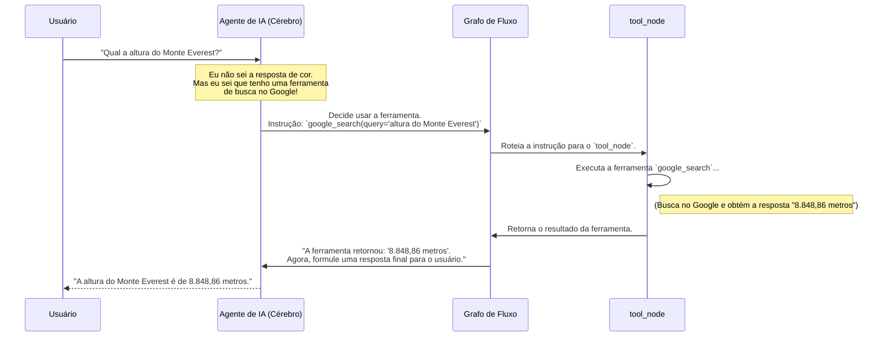

# Chapter 4: Caixa de Ferramentas (Integração Arcade)


Nos capítulos anteriores, construímos um chatbot com um cérebro para pensar ([Capítulo 2: Agente de IA](02_agente_de_ia__o_cérebro__.md)) e uma memória para lembrar ([Capítulo 3: Memória da Conversa](03_memória_da_conversa___messagesstate__e__memorysaver___.md)). Ele já é inteligente, mas suas habilidades ainda são limitadas ao que ele sabe internamente. E se quiséssemos que ele fizesse algo no mundo real, como pesquisar a previsão do tempo ou buscar as últimas notícias?

Bem-vindo à "Caixa de Ferramentas"! Este capítulo é sobre dar superpoderes ao nosso chatbot. Vamos conectá-lo a um conjunto de ferramentas que lhe permitem interagir com o mundo exterior. Pense nisso como dar a um cérebro brilhante um par de mãos e acesso à internet.

## O Que é uma Caixa de Ferramentas?

Imagine que seu chatbot é um assistente pessoal muito inteligente. Se você perguntar "Quem foi Santos Dumont?", ele pode responder usando o conhecimento com o qual foi treinado. Mas se você perguntar "Qual a cotação do dólar *agora*?", ele tem um problema. Essa informação muda a todo momento e não faz parte de seu conhecimento estático.

É aqui que as ferramentas entram. Uma "ferramenta" é simplesmente uma função que o chatbot pode chamar para realizar uma tarefa específica, como:

*   Pesquisar algo no Google.
*   Consultar uma API de previsão do tempo.
*   Buscar informações em um banco de dados.

Neste projeto, usamos a plataforma **Arcade** para gerenciar essas ferramentas. A Arcade facilita a conexão com diversas APIs (como a do Google Search) de forma segura e padronizada.

Para fazer isso funcionar, precisamos de dois componentes principais:
1.  **`ArcadeToolManager`**: O gerente que organiza as ferramentas.
2.  **`tool_node`**: A oficina onde as ferramentas são usadas.

Vamos conhecer cada um deles.

### 1. `ArcadeToolManager`: O Gerente de Ferramentas

Pense no `ArcadeToolManager` como o gerente de um grande depósito de ferramentas. Sua função não é usar as ferramentas, mas sim:

*   Saber quais ferramentas estão disponíveis (no nosso caso, as da Arcade).
*   Manter um inventário organizado.
*   Entregar a ferramenta certa no formato que nosso [Agente de IA (O Cérebro)](02_agente_de_ia__o_cérebro__.md) entende.

No nosso código, inicializamos esse gerente e pedimos a ele um conjunto específico de ferramentas — neste caso, as ferramentas do "toolkit" do Google.

Veja como isso é feito no arquivo `src/arcade.py`:

```python
# Arquivo: src/arcade.py

from langchain_arcade import ArcadeToolManager
from src.config import ARCADE_API_KEY

# 1. Inicializa o gerente de ferramentas com nossa chave de API da Arcade.
tool_manager = ArcadeToolManager(api_key=ARCADE_API_KEY)

# 2. Pede ao gerente para buscar todas as ferramentas do kit "Google".
tools = tool_manager.get_tools(toolkits=["Google"])
```

**O que este código faz?**

*   `tool_manager = ArcadeToolManager(...)`: Criamos uma instância do nosso gerente. Ele agora está conectado à plataforma Arcade, pronto para nos fornecer ferramentas.
*   `tools = tool_manager.get_tools(...)`: Solicitamos ao gerente: "Por favor, me dê a lista de todas as ferramentas disponíveis no 'kit do Google'". O resultado é uma lista de objetos `tool` que o nosso agente de IA pode entender. No [Capítulo 2](02_agente_de_ia__o_cérebro__.md), vimos como essa lista de `tools` é "vinculada" ao cérebro do chatbot com `llm.bind_tools(tools)`. É assim que o agente fica sabendo que tem o poder de pesquisar no Google!

### 2. `ToolNode`: A Oficina de Execução

Agora que temos as ferramentas, precisamos de um lugar para usá-las. Se o `ArcadeToolManager` é o gerente que fornece a ferramenta, o `ToolNode` é a **oficina**.

O `ToolNode` é um nó especializado em nosso [Grafo de Fluxo de Trabalho (Workflow)](05_grafo_de_fluxo_de_trabalho__workflow__.md). Sua única responsabilidade é:

1.  Receber uma instrução do agente (ex: "Use a ferramenta `google_search` com a pergunta 'Qual a capital da Austrália?'").
2.  Executar a ferramenta com os argumentos fornecidos.
3.  Pegar o resultado (ex: "Canberra") e devolvê-lo ao fluxo da conversa.

Criamos nossa oficina (`tool_node`) e a abastecemos com as ferramentas que o gerente nos deu.

```python
# Arquivo: src/arcade.py (continuação)

from langgraph.prebuilt import ToolNode

# ... código anterior ...
tools = tool_manager.get_tools(toolkits=["Google"])

# Cria a "oficina" e a abastece com as ferramentas do Google.
tool_node = ToolNode(tools)
```

**O que este código faz?**

*   `tool_node = ToolNode(tools)`: Estamos criando uma instância do `ToolNode`, que é uma classe pronta da biblioteca `LangGraph`. Ao passar a lista `tools` para ele, estamos dizendo: "Esta oficina está equipada para operar todas estas ferramentas".

## O Fluxo de Execução de uma Ferramenta

Vamos visualizar o processo completo. Como uma simples pergunta do usuário aciona todo esse mecanismo?



Este diagrama mostra a colaboração perfeita:

1.  O **Agente** age como o cérebro, decidindo *qual* ferramenta usar.
2.  O **Grafo** age como o sistema nervoso, roteando a decisão para o lugar certo.
3.  A **Oficina (`tool_node`)** age como as mãos, executando a tarefa e retornando o resultado.

## Integrando a Oficina ao Nosso Fluxo de Trabalho

Para que o grafo saiba da existência da nossa oficina, precisamos registrá-la. Fazemos isso no arquivo `src/workflow.py`, onde montamos nosso fluxo de trabalho.

```python
# Arquivo: src/workflow.py

from src.arcade import tool_node # Importa nossa oficina
from langgraph.graph import StateGraph

def get_workflow():
  # ... (código de criação do workflow)
  workflow = StateGraph(MessagesState)

  # Adiciona o nó "agent"
  workflow.add_node("agent", call_agent)
  # Adiciona o nó "tools": a nossa oficina!
  workflow.add_node("tools", tool_node)
  
  # ... (o resto da definição do grafo) ...

  # Após executar as ferramentas na oficina, volte para o agente
  # para que ele possa analisar o resultado.
  workflow.add_edge("tools", "agent")

  return workflow
```

**O que este código faz?**

*   `from src.arcade import tool_node`: Primeiro, importamos a oficina que criamos.
*   `workflow.add_node("tools", tool_node)`: Aqui, estamos oficialmente adicionando a oficina ao nosso fluxograma. Damos a ela o nome de `"tools"`. Agora, o grafo sabe que existe um nó com esse nome e que ele corresponde à nossa `tool_node`.
*   `workflow.add_edge("tools", "agent")`: Esta linha é crucial. Ela define uma "aresta" ou um caminho no nosso grafo. Estamos dizendo: "Depois que o nó `tools` (a oficina) terminar seu trabalho, o próximo passo é sempre voltar para o nó `agent` (o cérebro)". Isso permite que o agente veja o resultado da ferramenta e formule uma resposta final e amigável para o usuário.

## Conclusão

Parabéns! Você acabou de dar superpoderes ao seu chatbot. Não é mais apenas um cérebro que conversa, mas um agente capaz de realizar ações no mundo real.

Neste capítulo, aprendemos a:

*   Usar o **`ArcadeToolManager`** como um gerente para obter e organizar ferramentas, como a pesquisa no Google.
*   Configurar um **`ToolNode`** como uma oficina especializada, pronta para executar as instruções do agente.
*   Integrar essa oficina (`tool_node`) ao nosso fluxo de trabalho, permitindo que o chatbot decida usar uma ferramenta, a execute e use o resultado para responder de forma mais completa.

Até agora, montamos várias peças separadas: um ponto de entrada, um cérebro, uma memória e uma caixa de ferramentas. Mas como exatamente essas peças se encaixam para formar um fluxo de conversa coeso? Como o sistema sabe quando chamar o agente, quando usar uma ferramenta ou quando simplesmente terminar?

No próximo capítulo, vamos montar o quebra-cabeça. Vamos explorar a planta baixa de toda a nossa operação. Vamos para o [Capítulo 5: Grafo de Fluxo de Trabalho (Workflow)](05_grafo_de_fluxo_de_trabalho__workflow__.md).

---

Generated by [AI Codebase Knowledge Builder](https://github.com/The-Pocket/Tutorial-Codebase-Knowledge)