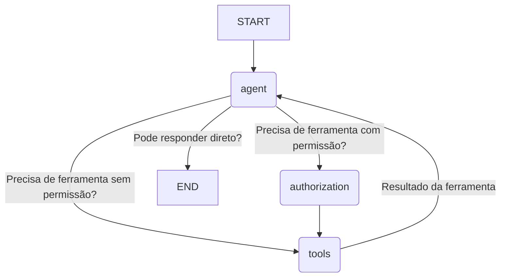
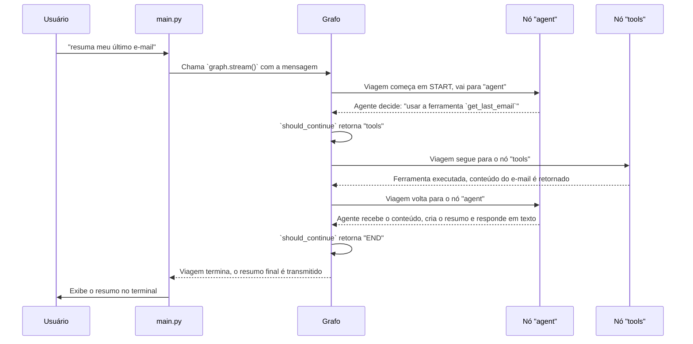

# Chapter 4: Grafo de Fluxo de Trabalho


Nos capítulos anteriores, montamos as peças fundamentais da nossa aplicação. Criamos o [Ciclo de Interação](01_ponto_de_entrada_e_ciclo_de_interação_.md) para conversar, adicionamos as [Ferramentas do Gmail](02_ferramentas_do_gmail__via_arcade__.md) para agir e implementamos o [Agente de IA](03_agente_de_ia_.md) para pensar. Agora, temos um cérebro, mãos e uma voz. Mas como essas partes se comunicam? Como o cérebro diz para a mão qual ferramenta pegar?

Bem-vindo ao sistema nervoso central da nossa aplicação: o **Grafo de Fluxo de Trabalho**. Este é o maestro que rege toda a orquestra, garantindo que cada peça toque na hora certa.

### O Problema: Como Orquestrar Ações Complexas?

Imagine que você pede: "Resuma meu último e-mail e depois me diga o tempo em São Paulo". Esta não é uma tarefa única. Ela envolve uma sequência de passos:
1.  O agente precisa entender que há duas tarefas.
2.  Ele decide usar a ferramenta de e-mail primeiro.
3.  O sistema executa a ferramenta e obtém o conteúdo do e-mail.
4.  O resultado volta para o agente, que resume o e-mail.
5.  O agente percebe que ainda falta a segunda tarefa.
6.  Ele decide usar uma (hipotética) ferramenta de previsão do tempo.
7.  O sistema executa essa ferramenta.
8.  O resultado volta para o agente, que formula a resposta final.

Gerenciar essa lógica de "vai e volta" pode se tornar um pesadelo de código complexo com `if/else` aninhados. Precisamos de uma maneira limpa e visual de definir o "fluxo" de operações.

### A Solução: Um Mapa de Metrô para a Lógica

É aqui que entra o **Grafo de Fluxo de Trabalho**, uma tecnologia da biblioteca `LangGraph`. Pense nele exatamente como o mapa do metrô de uma cidade:

*   **Nós (Nodes):** Cada "estação" no mapa é um **nó**. Um nó representa uma ação ou uma etapa de processamento, como `chamar_agente` ou `executar_ferramentas`.
*   **Arestas (Edges):** As "linhas de metrô" que conectam as estações são as **arestas**. Elas definem os caminhos possíveis. Uma aresta diz: "Depois de sair da estação A, vá para a estação B".

Algumas arestas são diretas (depois de A, sempre vá para B), enquanto outras são **condicionais** (depois de A, um "sinaleiro" decide se você vai para B, C ou D). Isso nos permite criar fluxos de trabalho inteligentes e dinâmicos.

Vamos construir nosso mapa de metrô no arquivo `src/workflow.py`.

#### Passo 1: Criar o Mapa em Branco

Primeiro, criamos um novo grafo. É como pegar uma folha de papel em branco para desenhar nosso mapa.

```python
# src/workflow.py

from langgraph.graph import StateGraph, END, START
# ... outros imports

def get_workflow():
  """Obtém o workflow (nós e arestas)"""

  # Cria um novo grafo de fluxo de trabalho.
  # Ele sabe que vai gerenciar um estado do tipo MessagesState.
  workflow = StateGraph(MessagesState)
  
  # ... vamos adicionar as estações e linhas aqui ...
  
  return workflow
```

`StateGraph(MessagesState)` cria um grafo especializado em gerenciar conversas. `MessagesState` é um objeto que guarda o histórico de todas as mensagens trocadas, para que nosso agente tenha memória.

#### Passo 2: Adicionar as Estações (Nós)

Agora, vamos adicionar as principais "estações" ao nosso mapa. Cada estação está ligada a uma função que faz o trabalho pesado.

```python
# src/workflow.py (dentro da função get_workflow)

from src.agents import call_agent, should_continue, authorize
from src.tools import tool_node

# ...

# Adiciona o nó "agent": quando ativado, ele chama a função call_agent.
workflow.add_node("agent", call_agent)
# Adiciona o nó "tools": responsável por executar ferramentas.
workflow.add_node("tools", tool_node)
# Adiciona o nó "authorization": para lidar com a autorização.
workflow.add_node("authorization", authorize)
```

Temos três estações principais:
1.  `"agent"`: A estação do [Agente de IA](03_agente_de_ia_.md). É aqui que o cérebro pensa e toma decisões.
2.  `"tools"`: A oficina, onde as [Ferramentas do Gmail](02_ferramentas_do_gmail__via_arcade__.md) são executadas.
3.  `"authorization"`: O guichê de permissões, que será explicado em detalhes no [próximo capítulo](05_mecanismo_de_autorização_.md).

#### Passo 3: Desenhar as Linhas do Metrô (Arestas)

Com as estações no lugar, precisamos conectá-las com as linhas de metrô.

Primeiro, definimos o ponto de partida. Toda jornada começa na estação `"agent"`.

```python
# src/workflow.py (dentro da função get_workflow)

# Define a primeira aresta: do ponto inicial (START), vá para o nó "agent".
workflow.add_edge(START, "agent")
```

Agora, a parte mais inteligente. Depois da estação `"agent"`, o caminho não é fixo. Precisamos de um sinaleiro para decidir para onde ir. Usamos uma **aresta condicional**:

```python
# src/workflow.py (dentro da função get_workflow)

# Após o nó "agent", chame a função should_continue para decidir o próximo passo.
workflow.add_conditional_edges(
  "agent",
  should_continue, # A função que toma a decisão
  ["authorization", "tools", END], # Os destinos possíveis
)
```

Isso diz ao grafo:
> "Depois de executar o nó `agent`, chame a função `should_continue`. Dependendo do que ela retornar (`"authorization"`, `"tools"`, ou `END`), siga para a estação correspondente."

`END` é uma estação especial que significa "a viagem terminou por agora".

Finalmente, definimos as linhas fixas restantes:

```python
# src/workflow.py (dentro da função get_workflow)

# Se o fluxo for para "authorization", o próximo passo deve ser "tools".
workflow.add_edge("authorization", "tools")

# Após executar as ferramentas, volte para o agente para ele ver os resultados.
workflow.add_edge("tools", "agent")
```
- Se o trem for para a estação `authorization`, a próxima parada é sempre `tools`.
- Depois que as ferramentas são usadas na estação `tools`, o trem sempre volta para a estação `agent`, para que ele possa analisar os resultados e decidir o que fazer a seguir.

### Visualizando Nosso Fluxo de Trabalho

Um diagrama torna tudo mais claro. Nosso código acabou de construir o seguinte mapa:



Este mapa visual mostra exatamente como a informação flui pela nossa aplicação. É limpo, organizado e fácil de entender.

### Compilando o Mapa em um Aplicativo Real

Até agora, `workflow` é apenas um projeto, um mapa no papel. Para torná-lo um sistema funcional que podemos executar, precisamos "compilá-lo". Isso é feito no arquivo `src/graph.py`.

```python
# src/graph.py

from langgraph.checkpoint.memory import MemorySaver
from src.workflow import get_workflow

def get_graph():
  """Obtém o grafo compilado"""
  workflow = get_workflow()

  # Cria uma instância do nosso "salvador de memória"
  memory = MemorySaver()

  # Compila o workflow em um grafo executável.
  # O checkpointer garante que o estado seja salvo a cada passo.
  graph = workflow.compile(checkpointer=memory)

  return graph
```
A linha `workflow.compile(...)` pega nosso projeto (`workflow`) e o transforma em um objeto `graph` executável. O `checkpointer` é um mecanismo de memória que garante que o grafo se lembre do histórico da conversa a cada passo, o que é crucial para o contexto. Falaremos mais sobre isso no capítulo de [Gerenciamento de Estado e Memória](06_gerenciamento_de_estado_e_memória_.md).

É este objeto `graph` compilado que usamos em nosso `main.py` para processar as solicitações do usuário!

### O Fluxo em Ação: Uma Viagem Completa

Vamos seguir uma solicitação do usuário através do nosso mapa recém-criado. Você digita: **"resuma meu último e-mail"**.



O grafo gerencia perfeitamente essa dança complexa: de agente para ferramenta, e de volta para agente, garantindo que tudo aconteça na ordem correta, sem que precisemos escrever uma lógica confusa.

### Conclusão

Parabéns! Você acabou de montar a espinha dorsal da nossa aplicação. O **Grafo de Fluxo de Trabalho** não é apenas código; é uma nova forma de pensar sobre a lógica do programa. Em vez de `if/else` aninhados, desenhamos um mapa claro com estações (nós) e trilhos (arestas).

Vimos como definir os nós para cada ação principal e como usar arestas (especialmente as condicionais) para criar um fluxo inteligente e cíclico. Essa estrutura é o que permite que nosso agente e ferramentas colaborem de forma tão eficaz.

Agora que entendemos o fluxo geral e vimos a estação `"authorization"` em nosso mapa, é hora de descobrir o que acontece quando o agente precisa de uma permissão especial para acessar seus dados.

A seguir: [Capítulo 5: Mecanismo de Autorização](05_mecanismo_de_autorização_.md)

---

Generated by [AI Codebase Knowledge Builder](https://github.com/The-Pocket/Tutorial-Codebase-Knowledge)