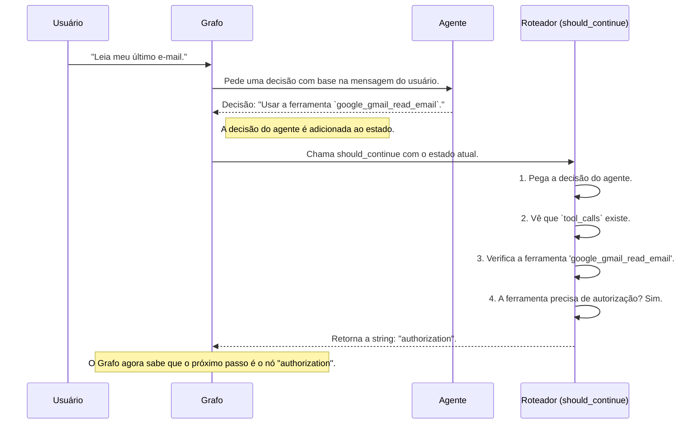

# Chapter 4: Roteador de Decisões


No [Capítulo 3: Grafo de Fluxo de Trabalho](03_grafo_de_fluxo_de_trabalho_.md), nós construímos o esqueleto da nossa aplicação. Definimos os diferentes "passos" (nós) e as "estradas" (arestas) que os conectam. Vimos uma "bifurcação" especial no nosso mapa, uma aresta condicional que depende de uma função mágica chamada `should_continue` para decidir para onde ir.

Mas como essa função sabe qual caminho tomar? Como ela decide entre "ir para a caixa de ferramentas", "pedir autorização primeiro" ou "encerrar a conversa"?

Bem-vindo ao centro de controle do nosso fluxo: o **Roteador de Decisões**. Este capítulo é inteiramente dedicado a essa função crucial, que atua como um controlador de tráfego inteligente no coração do nosso grafo.

## O Recepcionista Inteligente do Nosso Fluxo

Imagine que nosso Agente Inteligente é um executivo ocupado. Depois de analisar um pedido, ele escreve uma instrução em um post-it, como "Ligar para o cliente X" ou "Acessar o arquivo confidencial Y". Ele então entrega esse post-it a um recepcionista.

O trabalho do recepcionista é ler o post-it e encaminhar a tarefa para o lugar certo:
-   **Instrução:** "Ligar para o cliente X."
-   **Recepcionista:** "Isso é uma tarefa comum. Vou enviar para a equipe de operações (a caixa de ferramentas)."
-   **Instrução:** "Acessar o arquivo confidencial Y."
-   **Recepcionista:** "Opa, isso precisa de permissão. Vou enviar primeiro para o setor de segurança (o porteiro de autorização)."
-   **Instrução:** "Já tenho a resposta, diga ao cliente."
-   **Recepcionista:** "Trabalho concluído. Pode finalizar."

A função `should_continue` é exatamente esse recepcionista. Ela olha para a "decisão" do nosso [Agente Inteligente](01_agente_inteligente_.md) e decide qual será o próximo passo no nosso [Grafo de Fluxo de Trabalho](03_grafo_de_fluxo_de_trabalho_.md).

## Como o Roteador se Encaixa no Grafo

Vamos revisitar brevemente como configuramos a bifurcação no nosso grafo. Lembre-se desta parte do código em `main.py`:

```python
# Arquivo: main.py

# ...

# Após o nó "agent", chame a função should_continue para decidir o próximo passo.
workflow.add_conditional_edges(
    "agent",  # O ponto de partida é o nó "agent"
    should_continue,  # A função que toma a decisão
    ["authorization", "tools", END]  # Os destinos possíveis
)
```

Isto diz ao LangGraph: "Sempre que você terminar de executar o nó `agent`, não siga um caminho fixo. Em vez disso, execute a função `should_continue`. O resultado dessa função (uma string) me dirá para qual dos próximos nós (`authorization`, `tools` ou `END`) devo ir."

Agora, vamos finalmente abrir o capô e ver como a função `should_continue` realmente funciona.

## A Lógica por Trás da Decisão

A função `should_continue` está localizada no arquivo `src/flow.py`. Ela é surpreendentemente concisa, mas cada linha tem um propósito claro.

```python
# Arquivo: src/flow.py

from langgraph.graph import END
from src.arcade import tool_manager

def should_continue(state: MessagesState):
    # 1. Pega a última mensagem, que é a decisão do agente
    last_message = state["messages"][-1]

    # 2. Verifica se o agente decidiu usar uma ferramenta
    if last_message.tool_calls:
        # 3. Itera sobre cada ferramenta que o agente quer usar
        for tool_call in last_message.tool_calls:
            # 4. Pergunta se a ferramenta precisa de autorização
            if tool_manager.requires_auth(tool_call["name"]):
                # Se sim, o próximo passo é a autorização
                return "authorization"
        # Se nenhuma ferramenta precisou de autorização, vá para as ferramentas
        return "tools"
    
    # 5. Se o agente não chamou nenhuma ferramenta, o trabalho terminou
    return END
```

Vamos analisar o processo de pensamento desta função passo a passo:

1.  **"Qual foi a última coisa que o agente disse?"**: A linha `last_message = state["messages"][-1]` pega a resposta mais recente do nosso agente. Esta resposta contém suas intenções.

2.  **"O agente quer usar alguma ferramenta?"**: O `if last_message.tool_calls:` é a verificação mais importante. Se `tool_calls` existir, significa que o agente não deu uma resposta final, mas sim uma instrução para usar uma ou mais ferramentas. Se não houver `tool_calls`, o agente já tem a resposta final, e a função retorna `END`, encerrando o fluxo.

3.  **"Vamos verificar cada ferramenta solicitada"**: O `for` loop examina cada ferramenta que o agente pediu para usar.

4.  **"Esta ferramenta é sensível?"**: Aqui está o núcleo da lógica de segurança. A linha `tool_manager.requires_auth(...)` pergunta ao nosso [Gerenciador de Ferramentas Arcade](05_gerenciador_de_ferramentas_arcade_.md) se a ferramenta em questão (identificada por `tool_call["name"]`) é uma daquelas que requer permissão explícita do usuário. Se **qualquer uma** das ferramentas solicitadas precisar de autorização, a função imediatamente retorna a string `"authorization"`. O fluxo é desviado para o nó de segurança.

5.  **"Tudo certo, pode prosseguir"**: Se o loop terminar sem que nenhuma ferramenta tenha exigido autorização, significa que todas são seguras para serem executadas diretamente. A função então retorna `"tools"`, enviando o fluxo para o nó que executa as ferramentas.

### Visualizando o Fluxo de Decisão

Podemos resumir a lógica da função `should_continue` com um fluxograma simples:

```mermaid
graph TD
    A[Início: Recebe a decisão do Agente] --> B{O Agente pediu para usar uma ferramenta?};
    B -- Não --> F[Fim da Conversa (retorna "END")];
    B -- Sim --> C{Alguma das ferramentas precisa de autorização?};
    C -- Sim --> D[Vá para o Porteiro de Segurança (retorna "authorization")];
    C -- Não --> E[Vá direto para a Caixa de Ferramentas (retorna "tools")];

    style F fill:#ffafcc,stroke:#333,stroke-width:2px
    style D fill:#f7dc6f,stroke:#333,stroke-width:2px
    style E fill:#a3e4d7,stroke:#333,stroke-width:2px
```

## O Roteador em Ação: Um Exemplo Prático

Vamos simular o que acontece quando o usuário faz um pedido que requer acesso a dados sensíveis, como "Leia meu último e-mail".



1.  **O Agente Decide:** O agente analisa o pedido e conclui que precisa usar a ferramenta `google_gmail_read_email`.
2.  **O Grafo Consulta o Roteador:** O controle passa para a função `should_continue`.
3.  **O Roteador Analisa:**
    - Ele vê que uma ferramenta (`google_gmail_read_email`) foi chamada.
    - Ele pergunta ao `tool_manager` sobre essa ferramenta.
    - O `tool_manager` (que exploraremos a seguir) responde: "Sim, essa ferramenta requer autorização".
4.  **O Roteador Direciona:** A função retorna imediatamente a string `"authorization"`.
5.  **O Grafo Obedece:** O [Grafo de Fluxo de Trabalho](03_grafo_de_fluxo_de_trabalho_.md) recebe a string `"authorization"` e direciona a execução para o nó `authorization`, garantindo que a segurança seja tratada antes que qualquer dado seja acessado.

## Conclusão

Neste capítulo, desvendamos a peça central da lógica do nosso grafo: o **Roteador de Decisões**. Aprendemos que esta simples função, `should_continue`, atua como um controlador de tráfego, garantindo que cada passo do nosso agente seja direcionado para o caminho correto.

Vimos que ele:
-   Inspeciona a decisão do [Agente Inteligente](01_agente_inteligente_.md) a cada passo.
-   Decide se a conversa terminou, se pode ir direto para as ferramentas ou se precisa de uma parada obrigatória no posto de segurança.
-   É o mecanismo que alimenta a aresta condicional do nosso grafo, tornando nosso fluxo de trabalho dinâmico e seguro.

Uma pergunta pode ter ficado no ar: como o roteador sabe quais ferramentas são "sensíveis"? Ele confia em um ajudante, o `tool_manager`, para obter essa informação. Esse gerenciador não apenas sabe quais ferramentas precisam de autorização, mas também gerencia todo o conjunto de habilidades que nosso agente pode usar.

Está na hora de conhecer o "zelador" das nossas ferramentas. No próximo capítulo, vamos explorar como o `ArcadeToolManager` organiza, descreve e protege as ferramentas disponíveis para o nosso agente.

Vamos para o [Capítulo 5: Gerenciador de Ferramentas Arcade](05_gerenciador_de_ferramentas_arcade_.md).

---

Generated by [AI Codebase Knowledge Builder](https://github.com/The-Pocket/Tutorial-Codebase-Knowledge)