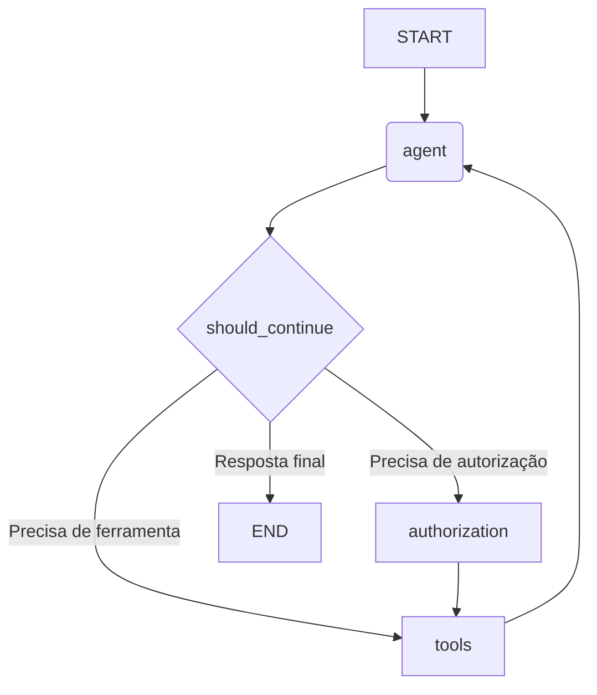

# Chapter 5: Grafo de Fluxo de Trabalho (Workflow)


Nos capítulos anteriores, montamos as peças essenciais do nosso chatbot: um [cérebro pensante](02_agente_de_ia__o_cérebro__.md), uma [memória para lembrar o contexto](03_memória_da_conversa___messagesstate__e__memorysaver___.md) e uma [caixa de ferramentas para agir](04_caixa_de_ferramentas__integração_arcade__.md). Agora, temos todas essas partes poderosas, mas elas estão como peças de Lego espalhadas. Como conectamos tudo para que funcione em harmonia?

Bem-vindo ao sistema nervoso central do nosso projeto: o **Grafo de Fluxo de Trabalho (Workflow)**. Pense nele como a planta baixa de uma fábrica inteligente. Ele define exatamente onde cada estação de trabalho está localizada e como o produto (a resposta do chat) se move de uma estação para a outra até ficar pronto.

## O Que é um Grafo de Fluxo de Trabalho?

Imagine que você está gerenciando um projeto. Você não executa todas as tarefas ao mesmo tempo. Em vez disso, você desenha um fluxograma:

1.  **Começar:** Receber a solicitação do cliente.
2.  **Analisar:** A equipe de análise avalia o pedido.
3.  **Decidir:** A análise precisa de dados externos?
    *   **Sim:** Envie para a equipe de pesquisa.
    *   **Não:** Envie direto para a equipe de redação.
4.  **Pesquisar:** A equipe de pesquisa coleta os dados.
5.  **Redigir:** A equipe de redação escreve a resposta final.
6.  **Fim:** Entregar a resposta ao cliente.

O nosso Grafo de Fluxo de Trabalho é exatamente esse fluxograma. Ele orquestra a conversa, garantindo que cada passo aconteça na ordem correta. Ele é construído com dois elementos básicos:

*   **Nós (Nodes):** As "estações de trabalho" ou as caixas do nosso fluxograma. Cada nó representa uma ação, como chamar o agente de IA ou executar uma ferramenta.
*   **Arestas (Edges):** As setas que conectam as caixas. Elas definem o caminho que a conversa seguirá de um nó para o outro.

Usando a biblioteca `LangGraph`, nós definimos esses nós e arestas em código, criando um sistema previsível e poderoso.

## Construindo a Planta Baixa (`workflow.py`)

Toda a lógica do nosso fluxograma está no arquivo `src/workflow.py`. Vamos desmontá-lo passo a passo para entender como ele é construído.

### 1. Inicializando o Grafo

Primeiro, precisamos criar uma "tela em branco" para o nosso fluxograma. Também dizemos a ele que tipo de informação ele vai gerenciar — no nosso caso, um histórico de mensagens, ou `MessagesState`.

```python
# Arquivo: src/workflow.py

from langgraph.graph import MessagesState, StateGraph

def get_workflow():
  """Obtém o workflow (nós e arestas)"""

  # Cria um novo grafo de fluxo de trabalho.
  # Ele sabe que vai gerenciar um estado do tipo MessagesState.
  workflow = StateGraph(MessagesState)

  # ... o resto da definição acontece aqui ...
  
  return workflow
```

**O que este código faz?**

*   `workflow = StateGraph(MessagesState)`: Estamos criando um `StateGraph`, que é a nossa "planta baixa". Ao passar `MessagesState`, estamos dizendo: "A principal informação que você vai rastrear ao longo deste fluxo é uma lista de mensagens", exatamente o que definimos no nosso capítulo sobre [Memória da Conversa](03_memória_da_conversa___messagesstate__e__memorysaver___.md).

### 2. Adicionando as Estações de Trabalho (Nós)

Agora, vamos adicionar as "estações de trabalho" (os nós) à nossa planta. Cada nó tem um nome e está associado a uma função que será executada quando o fluxo chegar até ele.

```python
# Arquivo: src/workflow.py (continuação)

from src.agents import call_agent, authorize
from src.arcade import tool_node

# ...

# Adiciona o nó "agent": quando ativado, ele chama a função call_agent.
workflow.add_node("agent", call_agent)
# Adiciona o nó "tools": responsável por executar ferramentas.
workflow.add_node("tools", tool_node)
# Adiciona o nó "authorization": para lidar com a autorização.
workflow.add_node("authorization", authorize)
```

**O que este código faz?**

*   `workflow.add_node("agent", call_agent)`: Estamos adicionando nossa primeira estação, chamada `"agent"`. Quando o fluxo de trabalho chegar a este nó, ele executará a função `call_agent`, que invoca nosso [Agente de IA (O Cérebro)](02_agente_de_ia__o_cérebro__.md).
*   `workflow.add_node("tools", tool_node)`: Adicionamos a estação `"tools"`. Ela executa o `tool_node` da nossa [Caixa de Ferramentas (Integração Arcade)](04_caixa_de_ferramentas__integração_arcade__.md) para usar ferramentas como a pesquisa no Google.
*   `workflow.add_node("authorization", authorize)`: Adicionamos a estação de segurança, o `"authorization"`. Falaremos mais sobre ela no [Capítulo 7: Guardião de Autorização (`authorize`)](07_guardião_de_autorização___authorize___.md).

### 3. Desenhando os Caminhos (Arestas)

Com as estações de trabalho no lugar, precisamos conectá-las com setas (as arestas) para definir o fluxo.

```python
# Arquivo: src/workflow.py (continuação)

from langgraph.graph import START, END

# Define a primeira aresta: do ponto inicial, vá para o nó "agent".
workflow.add_edge(START, "agent")

# Após executar as ferramentas, volte para o agente.
workflow.add_edge("tools", "agent")

# Se o fluxo for para "authorization", o próximo passo deve ser "tools".
workflow.add_edge("authorization", "tools")
```

**O que este código faz?**

*   `workflow.add_edge(START, "agent")`: Esta é a aresta mais importante! `START` é um ponto de partida especial. Estamos dizendo: "Toda conversa nova deve começar imediatamente no nó `agent`".
*   `workflow.add_edge("tools", "agent")`: Esta é uma regra fundamental. "Depois que o nó `tools` terminar seu trabalho, o fluxo **sempre** deve voltar para o nó `agent`". Por quê? Para que o agente possa ver o resultado da ferramenta (ex: "8.848 metros") e formular uma resposta bonita para o usuário (ex: "A altura do Monte Everest é 8.848 metros.").

### 4. A Encruzilhada: Arestas Condicionais

Até agora, os caminhos são diretos. Mas e quando precisamos tomar uma decisão? Após o agente pensar, ele pode ter três resultados possíveis:

1.  Ele tem a resposta final. (Fim da conversa)
2.  Ele precisa usar uma ferramenta. (Vá para o nó `tools`)
3.  Ele precisa de permissão para usar uma ferramenta. (Vá para o nó `authorization`)

Para lidar com isso, usamos uma **aresta condicional**.

```python
# Arquivo: src/workflow.py (continuação)

from src.agents import should_continue

# Após o nó "agent", chame a função should_continue para decidir o próximo passo.
workflow.add_conditional_edges(
  "agent",
  should_continue, # A função que toma a decisão
  {
      "authorize": "authorization",
      "continue": "tools",
      "end": END,
  },
)
```

**O que este código faz?**

*   `workflow.add_conditional_edges(...)`: Em vez de um caminho fixo, estamos criando uma encruzilhada.
*   `"agent"`: A decisão acontece logo após o nó `agent`.
*   `should_continue`: Esta é a função que atua como um "guarda de trânsito". Ela olha para a resposta do agente e decide para qual caminho enviar o fluxo. Vamos explorar exatamente como ela funciona no [próximo capítulo](06_roteador_de_decisões___should_continue___.md)!
*   `{...}`: Este é o mapa de destinos. Se `should_continue` retornar a palavra `"authorize"`, o fluxo vai para o nó `authorization`. Se retornar `"continue"`, vai para `tools`. Se retornar `"end"`, o fluxo termina (`END`).

## O Fluxograma Completo

Se fôssemos desenhar a planta baixa que acabamos de criar, ela se pareceria com isto:



Este diagrama visualiza perfeitamente a lógica do nosso chatbot. Você pode seguir o caminho de qualquer tipo de pergunta e ver exatamente quais estações ela visitará.

## Dando Vida ao Grafo (`graph.py`)

A planta baixa em `workflow.py` é apenas um plano. Para transformá-la em uma "fábrica" funcional, precisamos compilá-la. Isso é feito no arquivo `src/graph.py`.

```python
# Arquivo: src/graph.py

from langgraph.checkpoint.memory import MemorySaver
from src.workflow import get_workflow

def get_graph():
  """Obtém o grafo compilado"""

  workflow = get_workflow()

  # Cria uma instância do nosso "salvador de memória"
  memory = MemorySaver()

  # Compila o workflow em um grafo executável.
  # O checkpointer garante que o estado seja salvo a cada passo.
  graph = workflow.compile(checkpointer=memory)

  return graph
```

**O que este código faz?**

*   `graph = workflow.compile(checkpointer=memory)`: Este é o passo final. O método `.compile()` pega nossa planta baixa (`workflow`) e a transforma em um objeto executável (`graph`) que podemos usar no `main.py`. Ao conectar o `checkpointer`, garantimos que a [Memória da Conversa](03_memória_da_conversa___messagesstate__e__memorysaver___.md) seja salva a cada passo do fluxo, como aprendemos no Capítulo 3.

## Conclusão

Neste capítulo, você conectou todas as peças do nosso chatbot e se tornou o arquiteto do fluxo da conversa. Aprendemos que o **Grafo de Fluxo de Trabalho** é o componente que orquestra tudo, agindo como um sistema nervoso central.

Nós vimos como:

*   Definir **nós** como estações de trabalho que realizam ações específicas (pensar, usar ferramentas).
*   Definir **arestas** como os caminhos que conectam essas estações.
*   Usar **arestas condicionais** para criar encruzilhadas inteligentes no fluxo, permitindo que o sistema tome decisões dinâmicas.
*   **Compilar** o fluxograma para transformá-lo em um sistema funcional e pronto para uso.

Agora, nosso chatbot tem uma estrutura lógica e robusta. No entanto, ainda há uma peça misteriosa em nosso fluxograma: a função `should_continue`. Como ela sabe exatamente para onde direcionar a conversa?

No próximo capítulo, vamos nos aprofundar nessa função e desvendar a lógica de roteamento do nosso chatbot. Vamos para o [Capítulo 6: Roteador de Decisões (`should_continue`)](06_roteador_de_decisões___should_continue___.md).

---

Generated by [AI Codebase Knowledge Builder](https://github.com/The-Pocket/Tutorial-Codebase-Knowledge)