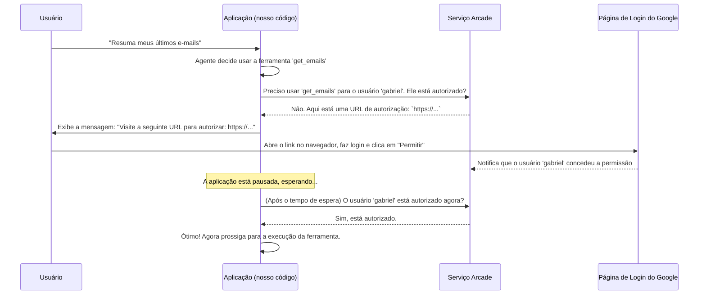

# Chapter 5: Mecanismo de Autorização


No [capítulo anterior](04_grafo_de_fluxo_de_trabalho_.md), montamos o mapa do metrô da nossa aplicação, o [Grafo de Fluxo de Trabalho](04_grafo_de_fluxo_de_trabalho_.md). Nós desenhamos as estações (`nós`) e as linhas que as conectam (`arestas`). Uma estação que mencionamos, mas não exploramos, foi a `"authorization"`. Você deve ter se perguntado: "O que acontece exatamente naquela parada?".

Bem-vindo ao guichê de segurança da nossa aplicação. Este é o capítulo onde garantimos que nosso aplicativo é poderoso, mas também respeitoso e seguro com os seus dados.

### O Problema: Como Acessar Dados Privados de Forma Segura?

Nossa aplicação pode usar [Ferramentas do Gmail](02_ferramentas_do_gmail__via_arcade__.md) para ler, resumir e enviar e-mails em seu nome. Isso é incrivelmente útil, mas também um pouco assustador. Como a aplicação prova para o Google que *você* realmente deu permissão para ela acessar sua caixa de entrada? Você não gostaria que qualquer programa pudesse ler seus e-mails sem o seu consentimento explícito.

É como tentar entrar na sua própria casa. Você pode ter a chave, mas se um segurança (o Google) estiver na porta, ele vai querer ver sua identidade para ter certeza de que é você mesmo. Nossa aplicação precisa de um "crachá" ou uma "identidade" aprovada por você para mostrar a esse segurança.

### A Solução: Um Guarda de Segurança que Pede Permissão

A solução é um **Mecanismo de Autorização**. Pense nele como o porteiro de um clube exclusivo. Quando nosso [Agente de IA](03_agente_de_ia_.md) decide usar uma ferramenta sensível (como `ler_emails`), o fluxo de trabalho é desviado para o nosso "porteiro".

O porteiro (nosso mecanismo) então verifica: "Este usuário já me deu um crachá de acesso para esta ferramenta?".
*   **Se sim:** "Ótimo, pode entrar e usar a ferramenta."
*   **Se não:** "Opa, espere um pouco. Você precisa obter um crachá. Por favor, vá até o escritório principal (um link de autorização do Google) e peça um. Eu espero aqui."

Este processo, conhecido como **OAuth 2.0**, é um padrão da indústria para delegação segura de acesso. Felizmente, o Arcade gerencia toda a complexidade para nós. Só precisamos implementar a lógica do "porteiro".

### O Nó de Autorização em Ação

Vamos ver o código que atua como nosso porteiro. Esta é a função `authorize` no arquivo `src/agents.py`, que é executada sempre que nosso grafo chega à estação `"authorization"`.

```python
# src/agents.py

from src.tools import tool_manager
# ... outros imports

# Função para lidar com a autorização para ferramentas que exigem isso
def authorize(state: MessagesState, config: dict):
    # Pega o ID do usuário da configuração da chamada
    user_id = config["configurable"].get("user_id")

    # Inspeciona a última mensagem para ver qual ferramenta o agente quer usar
    for tool_call in state["messages"][-1].tool_calls:
        tool_name = tool_call["name"]

        # O Arcade nos diz se esta ferramenta precisa de permissão
        if not tool_manager.requires_auth(tool_name):
            continue  # Pula para a próxima ferramenta se não precisar de permissão

        # Se precisar, nós iniciamos o processo de autorização com o Arcade
        auth_response = tool_manager.authorize(tool_name, user_id)

        # Se a autorização não estiver completa, precisamos da ajuda do usuário
        if auth_response.status != "completed":
            # Pede ao usuário que visite a URL para autorizar
            print(f"Visite a seguinte URL para autorizar: {auth_response.url}")

            # Pausa e espera o usuário concluir a autorização
            tool_manager.wait_for_auth(auth_response.id)

            # Uma verificação final para garantir que a autorização foi bem-sucedida
            if not tool_manager.is_authorized(auth_response.id):
                # Interrompe a execução se a autorização falhar
                raise ValueError("A autorização falhou")

    return {"messages": []} # Retorna uma mensagem vazia para continuar o fluxo
```

Uau, parece muita coisa! Mas não se preocupe. Vamos quebrar isso em passos lógicos, como um diálogo entre o porteiro e você.

#### Passo 1: Identificar a Ferramenta e o Usuário

```python
user_id = config["configurable"].get("user_id")
tool_name = tool_call["name"]
```
O porteiro primeiro olha para você e pergunta: "Quem é você?" (`user_id`) e "O que você quer fazer?" (`tool_name`).

#### Passo 2: Verificar se a Permissão é Necessária

```python
if not tool_manager.requires_auth(tool_name):
    continue
```
Em seguida, ele consulta seu manual (fornecido pelo `tool_manager` do Arcade) para ver se a atividade solicitada (`ler_emails`) é restrita. Se não for, ele simplesmente diz "Pode passar" (`continue`) e não se preocupa com o resto.

#### Passo 3: Tentar a Autorização e Verificar o Status

```python
auth_response = tool_manager.authorize(tool_name, user_id)

if auth_response.status != "completed":
    # ... precisa da ação do usuário ...
```
Se a permissão for necessária, o porteiro tenta o acesso. O Arcade responde com um status. Se o status for `"completed"`, significa que já temos um crachá válido e podemos prosseguir! Se não, o porteiro sabe que precisa da sua ajuda.

#### Passo 4: Pedir Ajuda ao Usuário

```python
# Pede ao usuário que visite a URL para autorizar
print(f"Visite a seguinte URL para autorizar: {auth_response.url}")

# Pausa e espera o usuário concluir a autorização
tool_manager.wait_for_auth(auth_response.id)
```
Este é o momento crucial. O porteiro se vira para você e diz: "Eu não posso deixar você passar. Por favor, vá até este endereço (`auth_response.url`) para obter seu crachá de acesso."

O programa então **pausa** e espera pacientemente (`wait_for_auth`). No seu terminal, você verá uma mensagem com um link. Você precisa copiar este link, colá-lo no seu navegador, fazer login na sua conta do Google e clicar em "Permitir".

#### Passo 5: Verificação Final

```python
if not tool_manager.is_authorized(auth_response.id):
    raise ValueError("A autorização falhou")
```
Depois que você volta do "escritório de crachás", o porteiro faz uma última verificação. Se você conseguiu o crachá (`is_authorized` retorna verdadeiro), ótimo! Se você cancelou ou algo deu errado, ele nega o acesso (`raise ValueError`) para proteger seus dados.

### Como Tudo se Conecta: A Dança da Autorização

Vamos visualizar essa interação com um diagrama de sequência. Imagine que é a primeira vez que você executa o comando "resuma meus e-mails".



Este fluxo garante que **nenhum dado seja acessado antes que você dê sua permissão explícita** através de uma página segura e oficial do Google.

### A Experiência do Usuário

Então, o que você realmente vê no seu terminal?
1.  Você digita: `> resuma meu último e-mail`
2.  O programa responde:
    ```
    Visite a seguinte URL para autorizar: https://accounts.google.com/o/oauth2/auth?.....
    ```
3.  O programa para de responder e fica esperando.
4.  Você copia o link, cola no navegador, concede a permissão e fecha a aba.
5.  O programa no terminal "acorda" e continua a execução, eventualmente mostrando o resumo do seu e-mail.

A melhor parte? Você só precisa fazer isso **uma vez por ferramenta**. O Arcade armazena com segurança a sua permissão (o "crachá") para uso futuro. Na próxima vez que você pedir para resumir seus e-mails, o porteiro verá que você já tem um crachá válido e deixará você passar instantaneamente!

### Conclusão

Parabéns! Você acabou de implementar a parte mais crítica de qualquer aplicação que lida com dados de usuários: a segurança e a confiança. Vimos como o **Mecanismo de Autorização** atua como um porteiro inteligente, garantindo que o acesso a ferramentas sensíveis só aconteça com o consentimento explícito do usuário.

Aprendemos como a função `authorize` usa o Arcade para verificar permissões, gerar um link de autorização quando necessário e esperar pela confirmação do usuário. Este mecanismo é o que transforma nossa ferramenta de um projeto interessante em uma aplicação robusta e confiável.

Agora que nossa aplicação sabe como obter e usar permissões, como ela *lembra* dessas permissões e do histórico da nossa conversa entre uma execução e outra? A resposta está em como gerenciamos seu estado e memória.

A seguir: [Capítulo 6: Gerenciamento de Estado e Memória](06_gerenciamento_de_estado_e_memória_.md)

---

Generated by [AI Codebase Knowledge Builder](https://github.com/The-Pocket/Tutorial-Codebase-Knowledge)