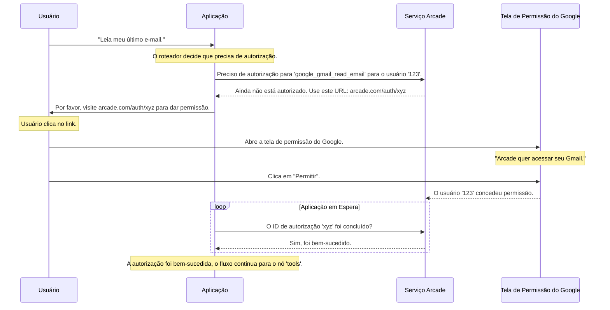

# Chapter 6: Fluxo de Autorização de Acesso


No [Capítulo 5: Gerenciador de Ferramentas Arcade](05_gerenciador_de_ferramentas_arcade_.md), descobrimos o "zelador" das nossas ferramentas. Ele nos ajuda a saber *quais* ferramentas nosso agente pode usar e, mais importante, *quando* uma ferramenta requer permissão. Vimos como o nosso [Roteador de Decisões](04_roteador_de_decisões_.md) desvia o fluxo para um nó de `"authorization"` sempre que uma ação sensível é solicitada.

Mas o que acontece exatamente nesse nó? Como a aplicação realmente para, pede consentimento ao usuário e continua de forma segura?

Bem-vindo ao capítulo final da nossa jornada. Aqui, vamos explorar o **Fluxo de Autorização de Acesso**, o porteiro de segurança que garante que nenhum dado privado seja acessado sem a sua permissão explícita.

## O Porteiro de Segurança em Ação

Imagine que você está em um prédio de alta segurança. Você chega na recepção e pede para acessar um cofre. O recepcionista (nosso [Agente Inteligente](01_agente_inteligente_.md)) não tem a chave. Em vez disso, ele chama o porteiro de segurança.

O porteiro não nega seu pedido. Ele o acompanha até um terminal, onde você precisa usar sua impressão digital (autenticação). O porteiro espera pacientemente. Assim que o sistema confirma sua identidade, ele abre a porta do cofre para você.

O Fluxo de Autorização de Acesso funciona exatamente como esse porteiro. Quando uma ferramenta como `google_gmail_read_email` é chamada, o fluxo é ativado. Ele:
1.  **Pausa** a execução normal da aplicação.
2.  **Gera** um link único para você, o usuário.
3.  **Instrui** você a visitar esse link para autorizar o acesso à sua conta Google.
4.  **Espera** pela confirmação de que você concedeu o acesso.
5.  **Continua** a execução somente após a permissão ser concedida.

Este processo garante que a privacidade e a segurança sejam a prioridade máxima.

## O Nó `authorize`: Onde a Mágica Acontece

No nosso [Grafo de Fluxo de Trabalho](03_grafo_de_fluxo_de_trabalho_.md), criamos um nó específico para lidar com isso: o nó `"authorization"`. Este nó executa uma função chamada `authorize`, localizada em `src/flow.py`.

Essa função é o coração do nosso porteiro de segurança. Vamos analisá-la em partes para entender como ela funciona.

### Passo 1: Iniciar o Processo de Autorização

A função `authorize` começa verificando qual ferramenta precisa de permissão e inicia o processo com o `ArcadeToolManager`.

```python
# Arquivo: src/flow.py

def authorize(state: MessagesState, config: dict):
    # Pega o ID do usuário da configuração da conversa
    user_id = config["configurable"].get("user_id")

    # Itera sobre as ferramentas que o agente quer usar
    for tool_call in state["messages"][-1].tool_calls:
        tool_name = tool_call["name"]
        
        # Pula ferramentas que não precisam de autorização
        if not tool_manager.requires_auth(tool_name):
            continue

        # Inicia o fluxo de autorização para a ferramenta e o usuário
        auth_response = tool_manager.authorize(tool_name, user_id)
        # ... o resto da lógica vem a seguir ...
```

O que está acontecendo aqui:
- A função recebe o estado da conversa e a `config`, que contém o `user_id` (por exemplo, `gabrielsilveira.web@gmail.com`). Isso é crucial para que o Arcade saiba *quem* está tentando dar a permissão.
- Ela verifica cada ferramenta que o agente solicitou.
- `tool_manager.authorize()` é a chamada chave. Ela diz ao Arcade: "Preciso de permissão para a ferramenta `tool_name` para o usuário `user_id`".
- O Arcade então gera uma resposta, `auth_response`, que contém o status e, se necessário, um URL de autorização.

### Passo 2: Pausar e Pedir Permissão ao Usuário

Se a ferramenta ainda não foi autorizada (`status != "completed"`), a aplicação precisa da ajuda do usuário. É aqui que ela pausa e exibe uma mensagem.

```python
# Continuação da função authorize em src/flow.py

        # Se a autorização não estiver completa, precisamos da ação do usuário
        if auth_response.status != "completed":
            # Imprime o link para o usuário visitar
            print(f"Visite a seguinte URL para autorizar: {auth_response.url}")

            # A aplicação para e espera a autorização ser concluída
            tool_manager.wait_for_auth(auth_response.id)

            # Após a espera, verifica se a autorização foi bem-sucedida
            if not tool_manager.is_authorized(auth_response.id):
                # Se falhar, interrompe a execução com um erro
                raise ValueError("A autorização falhou")
    
    # Se tudo correu bem, retorna uma lista de mensagens vazia para continuar
    return {"messages": []}
```
Esta é a parte mais interativa do processo:
1.  **Imprimir o Link:** A linha `print(f"Visite...")` é como o nosso porteiro lhe entrega o formulário para assinar. Ela exibe a URL que você deve abrir em seu navegador.
2.  **Esperar Pacientemente:** `tool_manager.wait_for_auth()` é o momento da pausa. A aplicação para de executar e fica esperando um sinal do Arcade de que o processo na web foi concluído (seja com sucesso ou falha).
3.  **Verificar o Resultado:** Após a espera, `tool_manager.is_authorized()` faz uma verificação final. Se a permissão foi concedida, a função termina silenciosamente, e o fluxo do grafo continua para o próximo nó (`"tools"`). Se não, ela lança um erro, parando a aplicação com segurança.

## O Fluxo de Autorização nos Bastidores

Pode parecer complexo, mas o fluxo de comunicação entre você, a aplicação, o Arcade e o Google é muito bem orquestrado. Vamos visualizar.



Este diagrama mostra a separação de responsabilidades:
-   A **Aplicação** gerencia o fluxo de trabalho, pausando e esperando.
-   O **Serviço Arcade** lida com a complexa interação com o Google, gerenciando os tokens de acesso de forma segura.
-   O **Usuário** tem o controle final, concedendo ou negando o acesso através de uma interface familiar e segura do Google.

Quando a função `authorize` termina com sucesso, o [Grafo de Fluxo de Trabalho](03_grafo_de_fluxo_de_trabalho_.md) simplesmente segue a aresta que definimos (`workflow.add_edge("authorization", "tools")`) e prossegue para executar a ferramenta, que agora tem a permissão necessária para funcionar.

## Conclusão: Uma Aplicação Completa e Segura

E com isso, chegamos ao fim da nossa jornada de construção! Ao longo destes seis capítulos, montamos uma aplicação de IA sofisticada, peça por peça.

Vamos recapitular o que construímos:

1.  Começamos com o cérebro, o [Agente Inteligente](01_agente_inteligente_.md), que entende pedidos em linguagem natural e planeja ações.
2.  Demos a ele uma memória com o [Gerenciamento de Estado da Conversa](02_gerenciamento_de_estado_da_conversa_.md), permitindo conversas contínuas e contextuais.
3.  Organizamos tudo em um [Grafo de Fluxo de Trabalho](03_grafo_de_fluxo_de_trabalho_.md), o esqueleto que define a sequência de operações da nossa aplicação.
4.  Criamos um [Roteador de Decisões](04_roteador_de_decisões_.md) inteligente, o controlador de tráfego que direciona o fluxo com base nas decisões do agente.
5.  Equipamos nosso agente com um conjunto de habilidades através do [Gerenciador de Ferramentas Arcade](05_gerenciador_de_ferramentas_arcade_.md), que também atua como um consultor de segurança.
6.  Finalmente, implementamos o **Fluxo de Autorização de Acesso**, garantindo que nossa aplicação seja não apenas inteligente, mas também segura e respeitosa com a privacidade do usuário.

Você agora entende os blocos de construção fundamentais de um agente autônomo moderno que pode interagir com ferramentas externas de forma segura. Cada conceito que exploramos — de agentes a grafos e fluxos de autorização — é uma peça essencial no quebra-cabeça de criar assistentes de IA verdadeiramente úteis e confiáveis.

Parabéns por concluir este tutorial! Esperamos que você se sinta inspirado a experimentar, modificar e construir suas próprias aplicações incríveis com essas ferramentas.

---

Generated by [AI Codebase Knowledge Builder](https://github.com/The-Pocket/Tutorial-Codebase-Knowledge)