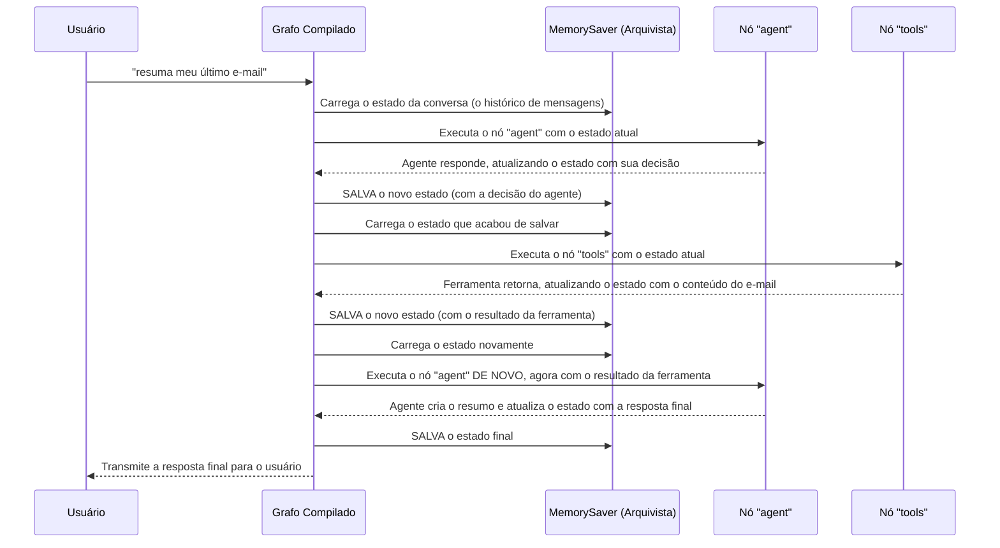

# Chapter 6: Gerenciamento de Estado e Memória


No [capítulo anterior](05_mecanismo_de_autorização_.md), construímos o guichê de segurança da nossa aplicação, o [Mecanismo de Autorização](05_mecanismo_de_autorização_.md). Garantimos que nossa ferramenta só acesse seus dados com sua permissão explícita, tornando-a poderosa e confiável. Agora, a aplicação pode conversar, pensar, agir e pedir permissão.

Mas falta uma última peça, talvez a mais sutil, porém crucial: como a aplicação se lembra do que falamos há um minuto? Como ela mantém o contexto de uma conversa?

Bem-vindo ao capítulo final, onde vamos dar à nossa aplicação uma memória de curto prazo.

### O Problema: A Aplicação com Amnésia

Imagine esta conversa:
*   **Você:** "Resuma meu último e-mail, por favor."
*   **Aplicação:** (Usa a ferramenta, lê o e-mail) "Claro. O resumo é: 'Reunião de projeto adiada para sexta-feira'."
*   **Você:** "Ótimo. Envie esse resumo para o João."

Uma aplicação sem memória ficaria confusa. "Qual resumo?", ela perguntaria. Ela já teria esquecido a primeira parte da conversa. Para realizar a segunda tarefa, ela precisaria se lembrar do resultado da primeira. Sem um mecanismo para reter informações entre os turnos da conversa, nosso agente seria inteligente, mas terrivelmente esquecido, tornando impossível qualquer tarefa de múltiplos passos.

### A Solução: Um Diário de Bordo para a Conversa

A solução é tratar cada conversa como se estivéssemos escrevendo em um diário de bordo. A cada passo — cada mensagem sua, cada resposta do agente, cada resultado de ferramenta — nós fazemos uma nova anotação. Quando o agente precisa tomar uma decisão, ele pode ler o diário inteiro para ter o contexto completo.

No LangGraph, esse "diário de bordo" é chamado de **Estado (State)**. É um objeto que armazena todas as informações importantes da conversa. O nosso [Grafo de Fluxo de Trabalho](04_grafo_de_fluxo_de_trabalho_.md) foi projetado para passar esse objeto de estado de um nó para outro, atualizando-o a cada passo.

#### Definindo o Formato das Anotações: `MessagesState`

Primeiro, precisamos definir o que queremos anotar no nosso diário. No nosso caso, o mais importante é o histórico de mensagens. Usamos um tipo especial de estado, o `MessagesState`, que é otimizado para isso.

Vimos isso brevemente ao criar nosso grafo em `src/workflow.py`:

```python
# src/workflow.py

from langgraph.graph import StateGraph, MessagesState
# ...

def get_workflow():
  # Cria um novo grafo de fluxo de trabalho.
  # Especificamos que ele vai gerenciar um estado do tipo MessagesState.
  workflow = StateGraph(MessagesState)
  
  # ... resto da definição do grafo ...
  
  return workflow
```

Ao dizer `StateGraph(MessagesState)`, estamos instruindo nosso grafo: "Seu trabalho é gerenciar um diário de bordo, e cada página desse diário conterá uma lista de mensagens." `MessagesState` é basicamente um contêiner que sabe como acumular mensagens de forma inteligente.

#### Contratando o Arquivista: `MemorySaver`

Ok, temos um diário. Mas quem garante que as anotações são salvas de forma persistente? E se o programa for fechado e reaberto? Queremos que a conversa continue de onde parou.

É aqui que entra o **checkpointer**. Pense nele como um arquivista super diligente. Após cada passo no nosso grafo, o arquivista pega a versão mais recente do "diário de bordo" (o estado) e a salva em um local seguro (neste caso, na memória do computador).

Nós "contratamos" esse arquivista no arquivo `src/graph.py` quando compilamos nosso grafo.

```python
# src/graph.py

from langgraph.checkpoint.memory import MemorySaver
from src.workflow import get_workflow

def get_graph():
  """Obtém o grafo compilado com memória."""

  workflow = get_workflow()

  # Cria uma instância do nosso "salvador de memória".
  # Este é o nosso arquivista.
  memory = MemorySaver()

  # Compila o workflow em um grafo executável.
  # O checkpointer garante que o estado seja salvo a cada passo.
  graph = workflow.compile(checkpointer=memory)

  return graph
```

Vamos analisar as duas linhas cruciais:
1.  **`memory = MemorySaver()`**: Aqui, criamos nosso arquivista. `MemorySaver` é o tipo mais simples de checkpointer; ele salva o estado na memória RAM. Para aplicações mais robustas, poderíamos usar um `SqliteSaver` para salvar em um arquivo de banco de dados, por exemplo.
2.  **`graph.compile(checkpointer=memory)`**: Esta é a instrução principal. Dizemos ao LangGraph: "Pegue o projeto do nosso fluxo de trabalho e transforme-o em uma aplicação funcional. E, mais importante, conecte este arquivista (`memory`) a ele. A partir de agora, ele é responsável por salvar e carregar o estado em cada etapa."

E é isso! Com essas poucas linhas, demos memória à nossa aplicação. Ela não é mais amnésica.

### Por Baixo dos Panos: O Ciclo de Leitura e Escrita

Como isso funciona na prática? Cada vez que você envia uma mensagem, um ciclo de "carregar, executar, salvar" acontece para cada nó do grafo.

Vamos visualizar o processo quando você pede para "resumir meu último e-mail".



Este ciclo de `Carregar -> Executar -> Salvar` é o coração da memória do nosso sistema. Ele garante que:
1.  **Contexto Completo:** Cada nó (seja o agente ou a ferramenta) sempre recebe o histórico completo e atualizado da conversa.
2.  **Resiliência:** Se o programa falhasse no meio da execução de uma ferramenta, ao reiniciar, ele poderia continuar exatamente de onde parou, pois o estado anterior foi salvo.
3.  **Conversas Contínuas:** Quando você envia a próxima mensagem ("Agora envie para o João"), o ciclo se repete. O grafo carrega o estado final da interação anterior, que contém o resumo, e o entrega ao [Agente de IA](03_agente_de_ia_.md). O agente agora vê o resumo e entende perfeitamente seu pedido de acompanhamento.

### Conclusão Final: A Jornada Completa

Parabéns! Você não apenas concluiu este capítulo, mas toda a jornada de construção de uma aplicação de agente de IA do zero. Vamos dar um passo para trás e admirar o que construímos juntos:

1.  No **[Capítulo 1: Ponto de Entrada e Ciclo de Interação](01_ponto_de_entrada_e_ciclo_de_interação_.md)**, criamos a porta da frente da nossa casa, um loop de terminal que nos permite conversar com o sistema.

2.  No **[Capítulo 2: Ferramentas do Gmail (via Arcade)](02_ferramentas_do_gmail__via_arcade__.md)**, equipamos a casa com uma caixa de ferramentas poderosa, dando à nossa aplicação as "mãos" para realizar tarefas no mundo real.

3.  No **[Capítulo 3: Agente de IA](03_agente_de_ia_.md)**, demos um "cérebro" à nossa aplicação, um motor de raciocínio capaz de entender pedidos e planejar ações.

4.  No **[Capítulo 4: Grafo de Fluxo de Trabalho](04_grafo_de_fluxo_de_trabalho_.md)**, projetamos o sistema nervoso, um mapa claro que orquestra como o cérebro e as mãos trabalham juntos.

5.  No **[Capítulo 5: Mecanismo de Autorização](05_mecanismo_de_autorização_.md)**, contratamos um segurança, garantindo que nossa aplicação seja poderosa, mas também segura e respeitosa com seus dados.

6.  E, finalmente, neste capítulo, demos à nossa aplicação uma **memória**, garantindo que ela possa manter conversas coerentes e se lembrar do contexto, assim como um assistente humano.

Você passou por todos os componentes essenciais de um agente de IA moderno. Agora você tem um projeto funcional que pode ser expandido com novas ferramentas, agentes mais inteligentes e mecanismos de memória mais robustos.

O mundo dos agentes de IA é vasto e está em constante evolução. Esperamos que este tutorial tenha servido como uma base sólida e um ponto de partida para suas próprias explorações. Continue experimentando, construindo e aprendendo

---

Generated by [AI Codebase Knowledge Builder](https://github.com/The-Pocket/Tutorial-Codebase-Knowledge)