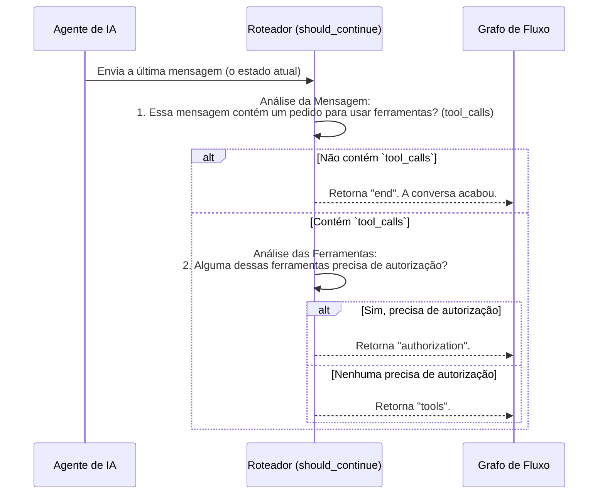

# Chapter 6: Roteador de Decisões (`should_continue`)


No [Capítulo 5: Grafo de Fluxo de Trabalho (Workflow)](05_grafo_de_fluxo_de_trabalho__workflow__.md), nós desenhamos a planta baixa do nosso chatbot, conectando todas as peças com nós e arestas. Vimos como a conversa flui de uma estação de trabalho para outra. No entanto, deixamos uma peça-chave do quebra-cabeça um pouco misteriosa: a encruzilhada, ou a aresta condicional. Como o nosso sistema decide para onde ir depois que o agente pensa?

Bem-vindo ao centro de controle de tráfego do nosso chatbot. Neste capítulo, vamos focar na pequena, mas crucial, função `should_continue`. Pense nela como um guarda de trânsito inteligente ou um carteiro experiente. Ela não cria a mensagem, mas olha para ela, entende seu destino e a direciona para o caminho certo. É essa função que torna nosso grafo dinâmico e capaz de reagir a diferentes situações.

## O Que é um Roteador de Decisões?

Imagine uma agência de correios. Quando uma carta chega, um funcionário a analisa para decidir o que fazer:

1.  A carta é um simples cartão postal? **Destino:** Caixa de saída final.
2.  A carta é um pacote que precisa ser processado? **Destino:** Setor de empacotamento.
3.  A carta é um documento valioso que precisa de assinatura e verificação de identidade? **Destino:** Setor de segurança e autorização.

A função `should_continue` faz exatamente isso. Após o [Agente de IA (O Cérebro)](02_agente_de_ia__o_cérebro__.md) gerar sua "resposta" (que pode ser uma mensagem final ou uma instrução para usar uma ferramenta), `should_continue` a inspeciona e toma uma decisão sobre o próximo passo. Ela retorna uma simples palavra que diz ao grafo para onde ir.

As três rotas possíveis são:

*   **`"end"`:** Se o agente deu uma resposta final. O trabalho está concluído.
*   **`"tools"`:** Se o agente decidiu usar uma ou mais ferramentas que não precisam de permissão especial. O fluxo segue para a [Caixa de Ferramentas](04_caixa_de_ferramentas__integração_arcade__.md).
*   **`"authorization"`:** Se o agente quer usar uma ferramenta que requer a permissão explícita do usuário. O fluxo é desviado primeiro para o nó de autorização.

## Onde o Roteador Entra em Ação?

O nosso roteador de decisões é usado em um lugar muito específico do nosso [Grafo de Fluxo de Trabalho (Workflow)](05_grafo_de_fluxo_de_trabalho__workflow__.md): na definição da aresta condicional. Vamos rever aquele trecho de código:

```python
# Arquivo: src/workflow.py

from src.agents import should_continue

# ...

# Após o nó "agent", chame a função should_continue para decidir o próximo passo.
workflow.add_conditional_edges(
  "agent",      # O ponto de partida da decisão é o nó "agent"
  should_continue, # A função que atua como guarda de trânsito
  {
      "authorization": "authorization", # Se retornar "authorization", vá para o nó de autorização
      "tools": "tools",           # Se retornar "tools", vá para o nó de ferramentas
      "end": END,                 # Se retornar "end", termine o fluxo
  },
)
```

**O que este código faz?**

*   Este bloco configura a "encruzilhada" no nosso fluxograma. Ele diz ao `LangGraph`: "Depois de executar o nó `agent`, não siga um caminho fixo. Em vez disso, chame a função `should_continue`."
*   O resultado (a palavra retornada) de `should_continue` é então usado para escolher o próximo destino a partir do dicionário fornecido. É uma maneira elegante de criar um fluxo lógico e dinâmico.

## Por Dentro do Roteador: Como a Decisão é Tomada

Agora, vamos abrir o capô e ver a lógica exata da função `should_continue` no arquivo `src/agents.py`. O processo é surpreendentemente simples e direto.

Primeiro, vamos visualizar o fluxo de pensamento do roteador.



Este diagrama mostra que a função segue uma lógica de prioridades: primeiro, verifica se precisa de ferramentas; se sim, verifica se precisa de autorização.

### O Código da Decisão

Vamos analisar o código que implementa essa lógica.

```python
# Arquivo: src/agents.py

from langgraph.graph import END, MessagesState
from src.arcade import tool_manager

def should_continue(state: MessagesState):
    # Pega a última mensagem e verifica se o agente decidiu usar uma ferramenta
    last_message = state["messages"][-1]
    
    if not last_message.tool_calls:
        # Se não há chamadas de ferramenta, o agente deu a resposta final.
        return END  # Termine o fluxo de trabalho.
```

**O que este código faz?**

1.  `last_message = state["messages"][-1]`: A função recebe o estado completo da conversa (`state`) e pega apenas a última mensagem, que é a decisão mais recente do agente.
2.  `if not last_message.tool_calls:`: Ela verifica se a mensagem do agente contém o atributo `tool_calls`. Se não houver `tool_calls`, significa que o agente não quer usar nenhuma ferramenta. Ele simplesmente formulou uma resposta textual.
3.  `return END`: Neste caso, a decisão é simples: o turno da conversa terminou. A função retorna a constante `END` (que o LangGraph internamente trata como `"end"`) e o grafo para.

E se o agente *quiser* usar uma ferramenta?

```python
# Arquivo: src/agents.py (continuação)

    # Se houver chamadas de ferramenta, precisamos verificar se alguma requer autorização.
    for tool_call in last_message.tool_calls:
        # Verifica se a ferramenta precisa de autorização
        if tool_manager.requires_auth(tool_call["name"]):
            # Se encontrarmos UMA que precisa, já podemos parar e direcionar.
            return "authorization"
            
    # Se o loop terminar e nenhuma ferramenta precisar de autorização...
    return "tools" # Prossiga para a execução normal da ferramenta.
```

**O que este código faz?**

1.  `for tool_call in last_message.tool_calls:`: Se a mensagem contém `tool_calls`, o código entra em um laço para verificar cada ferramenta que o agente quer usar.
2.  `if tool_manager.requires_auth(tool_call["name"]):`: Para cada ferramenta, ele pergunta ao nosso `tool_manager` (o gerente de ferramentas da Arcade): "Ei, a ferramenta com este nome (`tool_call["name"]`) precisa de autorização?".
3.  `return "authorization"`: Se o gerente responder "sim" para *qualquer uma* das ferramentas, a função para imediatamente e retorna a palavra `"authorization"`. A segurança é a prioridade máxima.
4.  `return "tools"`: Se o laço terminar e nenhuma das ferramentas solicitadas exigir autorização, a função conclui que é seguro prosseguir. Ela retorna a palavra `"tools"`, direcionando o fluxo para a oficina (`tool_node`).

## Conclusão

Neste capítulo, desvendamos o mecanismo de tomada de decisão que torna nosso grafo inteligente e flexível. Aprendemos que a função **`should_continue`** atua como um roteador de tráfego essencial.

Vimos que ela:

*   É chamada logo após o agente de IA tomar uma decisão.
*   Inspeciona a decisão do agente para ver se ele quer usar ferramentas.
*   Verifica se alguma dessas ferramentas tem requisitos especiais de segurança (autorização).
*   Retorna uma simples palavra-chave (`"end"`, `"tools"` ou `"authorization"`) que o [Grafo de Fluxo de Trabalho](05_grafo_de_fluxo_de_trabalho__workflow__.md) usa para direcionar a conversa para o próximo passo correto.

Com este roteador no lugar, nosso chatbot pode lidar com respostas simples, executar tarefas com ferramentas e, o mais importante, saber quando precisa parar e pedir permissão.

Essa última parte — pedir permissão — é crucial para construir um assistente confiável e seguro. No próximo capítulo, vamos explorar exatamente o que acontece quando o fluxo é direcionado para o caminho da `"authorization"`.

Vamos para o [Capítulo 7: Guardião de Autorização (`authorize`)](07_guardião_de_autorização___authorize___.md).

---

Generated by [AI Codebase Knowledge Builder](https://github.com/The-Pocket/Tutorial-Codebase-Knowledge)