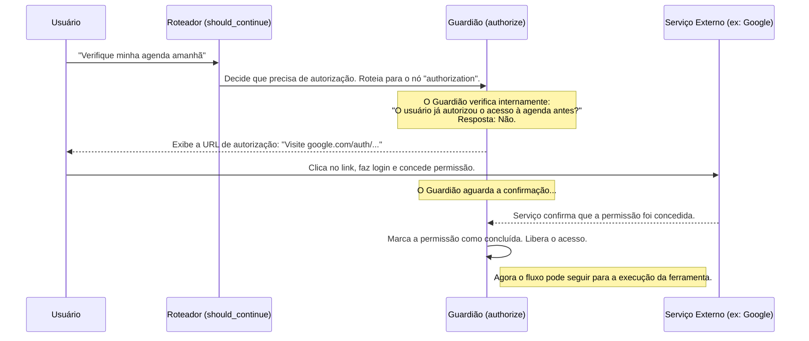

# Chapter 7: Guardião de Autorização (`authorize`)


No [Capítulo 6: Roteador de Decisões (`should_continue`)](06_roteador_de_decisões___should_continue___.md), construímos o guarda de trânsito do nosso chatbot, uma função inteligente que direciona a conversa para o caminho certo. Vimos que uma dessas rotas era a `"authorization"`, um desvio especial para quando o chatbot precisa de permissão para fazer algo.

Bem-vindo ao capítulo final, onde vamos conhecer o segurança do nosso sistema: o **Guardião de Autorização**. Pense nele como o porteiro de um clube exclusivo. Ele não apenas verifica quem você é, mas também garante que você tenha a credencial certa para entrar em áreas restritas. Este nó é a peça final que torna nosso chatbot não apenas inteligente, mas também seguro e confiável.

## O Que é um Guardião de Autorização?

Imagine que você pede ao seu chatbot: "Verifique minha agenda do Google para amanhã". Acessar sua agenda é uma ação muito sensível. O chatbot não pode simplesmente fazer isso sem sua permissão explícita. Ele precisa primeiro pedir autorização.

É exatamente esse o trabalho do Guardião de Autorização, a função `authorize`. Ele funciona como um segurança para ferramentas que acessam dados privados. Sua missão é:

1.  **Verificar Credenciais:** Antes de usar uma ferramenta sensível (como as do Google), ele verifica se você já deu permissão antes.
2.  **Solicitar Permissão:** Se você nunca deu permissão, ele gera uma URL especial para você visitar. Nessa página, você pode fazer login na sua conta Google e conceder o acesso.
3.  **Aguardar Confirmação:** O guardião pausa e espera pacientemente até que você confirme a autorização.
4.  **Liberar o Acesso:** Uma vez autorizado, ele permite que o fluxo continue para a [Caixa de Ferramentas (Integração Arcade)](04_caixa_de_ferramentas__integração_arcade__.md), que agora tem permissão para usar a ferramenta.

Sem este guardião, nosso chatbot poderia ser visto como invasivo ou inseguro. Com ele, garantimos que todas as ações sensíveis são realizadas com o seu consentimento total.

## Onde o Guardião se Encaixa no Fluxo?

No nosso [Grafo de Fluxo de Trabalho (Workflow)](05_grafo_de_fluxo_de_trabalho__workflow__.md), criamos uma estação de trabalho (`nó`) especificamente para o nosso guardião.

```python
# Arquivo: src/workflow.py

# ... importações ...
from src.agents import authorize

def get_workflow():
  # ...
  workflow = StateGraph(MessagesState)

  # Adiciona o nó "authorization" e o associa à função authorize.
  workflow.add_node("authorization", authorize)
  # ...

  # Se o fluxo for para "authorization", o próximo passo deve ser "tools".
  workflow.add_edge("authorization", "tools")

  return workflow
```

**O que este código faz?**

*   `workflow.add_node("authorization", authorize)`: Estamos registrando nosso guardião na planta baixa. O nó chamado `"authorization"` executará a função `authorize`.
*   `workflow.add_edge("authorization", "tools")`: Esta aresta define que, uma vez que o guardião termine seu trabalho (ou seja, a autorização seja bem-sucedida), o fluxo deve prosseguir para a oficina de ferramentas (`"tools"`), que agora tem sinal verde para agir.

Lembre-se de que é o nosso [Roteador de Decisões](06_roteador_de_decisões___should_continue___.md) que decide enviar a conversa para este nó em primeiro lugar.

## O Processo de Autorização Passo a Passo

Vamos visualizar o que acontece quando você pede algo que precisa de permissão.



Este diagrama mostra o diálogo entre o usuário e o sistema para estabelecer a confiança. É um processo que acontece apenas uma vez por ferramenta e por usuário. Nas próximas vezes, o guardião verá que você já autorizou e pulará direto para a etapa final.

## Por Dentro do Código do Guardião (`authorize`)

Agora, vamos analisar a implementação da função `authorize` em `src/agents.py`. Ela parece complexa, mas na verdade segue uma lógica muito clara.

### 1. Identificando o Usuário e a Ferramenta

O primeiro passo do guardião é saber *quem* está pedindo e *o quê* está sendo pedido.

```python
# Arquivo: src/agents.py

def authorize(state: MessagesState, config: dict):
    # Pega o ID do usuário da configuração da chamada.
    user_id = config["configurable"].get("user_id")

    # Itera sobre as ferramentas que o agente quer usar.
    for tool_call in state["messages"][-1].tool_calls:
        tool_name = tool_call["name"]

        # Verifica se a ferramenta realmente precisa de autorização.
        if not tool_manager.requires_auth(tool_name):
            continue # Se não precisar, pula para a próxima ferramenta.
        
        # ... o resto da lógica acontece aqui ...
```

**O que este código faz?**

*   `user_id = config["configurable"].get("user_id")`: O guardião pega a "identidade" do usuário, que passamos na configuração da chamada em `main.py`. É assim que ele sabe para quem pedir autorização.
*   `for tool_call in ...`: Ele examina a lista de ferramentas que o agente solicitou.
*   `if not tool_manager.requires_auth(tool_name):`: Para cada ferramenta, ele pergunta ao gerente de ferramentas da Arcade: "Esta ferramenta é sensível?". Se não for, ele a ignora e continua.

### 2. Verificando e Solicitando Autorização

Aqui está o coração da função. O guardião tenta obter a autorização e, se não conseguir, fornece ao usuário as instruções para concedê-la.

```python
# Arquivo: src/agents.py (continuação dentro do loop)

# Tenta obter a autorização para esta ferramenta e este usuário.
auth_response = tool_manager.authorize(tool_name, user_id)

# Se o status não for "completed", significa que a permissão é necessária.
if auth_response.status != "completed":
    # Solicita ao usuário que visite a URL para autorização.
    print(f"Visite a seguinte URL para autorizar: {auth_response.url}")

    # ... o próximo passo é aguardar ...
```

**O que este código faz?**

*   `auth_response = tool_manager.authorize(...)`: Esta é a chamada principal. O `tool_manager` da Arcade verifica se já existe uma autorização válida para essa combinação de `tool_name` e `user_id`.
*   `if auth_response.status != "completed"`: A resposta (`auth_response`) nos diz o estado. Se não for `"completed"`, significa que a autorização é inédita.
*   `print(f"...")`: O programa exibe a URL de autorização no console para que o usuário possa agir.

### 3. Aguardando a Confirmação

Depois de fornecer a URL, o programa não pode simplesmente continuar. Ele precisa esperar pela confirmação do usuário.

```python
# Arquivo: src/agents.py (continuação dentro do if)

    # Aguarda o usuário concluir a autorização.
    tool_manager.wait_for_auth(auth_response.id)

    # Verifica novamente se a autorização foi bem-sucedida.
    if not tool_manager.is_authorized(auth_response.id):
        # Interrompe a execução se a autorização falhar.
        raise ValueError("A autorização falhou")

# Se o loop terminar com sucesso, a função retorna um estado vazio para continuar.
return {"messages": []}
```

**O que este código faz?**

*   `tool_manager.wait_for_auth(...)`: Esta função bloqueia a execução. O programa fica em pausa aqui, esperando que o processo de autorização seja concluído nos servidores da Arcade (o que acontece depois que você clica no link e concede a permissão).
*   `if not tool_manager.is_authorized(...)`: Após a espera, ele faz uma verificação final para ter certeza de que a autorização foi concedida com sucesso. Se, por exemplo, o usuário fechou a janela ou negou o acesso, esta verificação falhará.
*   `raise ValueError(...)`: Se a autorização falhou, o programa para com um erro claro.
*   `return {"messages": []}`: Se todas as ferramentas necessárias forem autorizadas com sucesso, a função retorna uma lista de mensagens vazia. Isso sinaliza ao grafo que o nó foi concluído e que ele pode prosseguir para a próxima aresta, que o levará ao nó `"tools"`.

## Conclusão: Construindo um Chatbot Completo e Confiável

Parabéns! Você chegou ao final da nossa jornada de construção de um chatbot. Neste capítulo, implementamos o **Guardião de Autorização**, a peça que garante que nosso chatbot interaja com dados sensíveis de forma segura e com o consentimento do usuário. Aprendemos a:

*   Identificar quando uma ferramenta requer permissão.
*   Gerar uma URL de autorização para o usuário.
*   Pausar e aguardar a confirmação da permissão.
*   Integrar esse processo de segurança perfeitamente ao nosso fluxo de trabalho.

Ao longo desta série, você montou, peça por peça, um sistema de IA sofisticado. Vamos recapitular nossa jornada:

1.  Começamos com a [porta de entrada](01_ponto_de_entrada_e_interação_com_usuário_.md), aprendendo como o usuário interage com o sistema.
2.  Demos ao nosso chatbot um [cérebro pensante](02_agente_de_ia__o_cérebro__.md), capaz de entender e decidir.
3.  Equipamo-lo com uma [memória](03_memória_da_conversa___messagesstate__e__memorysaver___.md), para que ele pudesse manter o contexto da conversa.
4.  Demos a ele [mãos e braços](04_caixa_de_ferramentas__integração_arcade__.md) através de uma caixa de ferramentas para interagir com o mundo real.
5.  Desenhamos a [planta baixa](05_grafo_de_fluxo_de_trabalho__workflow__.md) que orquestra todo o fluxo de trabalho.
6.  Adicionamos um [roteador inteligente](06_roteador_de_decisões___should_continue___.md) para guiar a conversa por caminhos dinâmicos.
7.  E, finalmente, contratamos um [guardião de segurança](07_guardião_de_autorização___authorize___.md) para proteger os dados do usuário.

Você agora tem o conhecimento fundamental para construir, entender e modificar agentes de IA complexos e baseados em ferramentas. O projeto que você construiu é uma base sólida para explorar novas ferramentas, agentes mais avançados e integrações ainda mais poderosas. Continue experimentando e construindo

---

Generated by [AI Codebase Knowledge Builder](https://github.com/The-Pocket/Tutorial-Codebase-Knowledge)