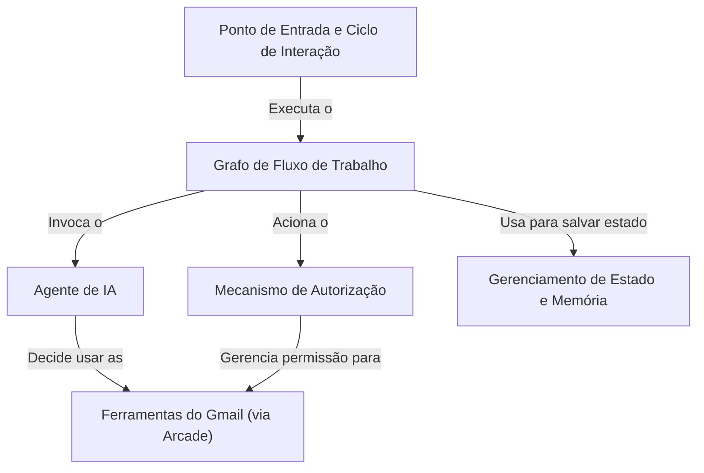

# Tutorial: Arcade Gmail Tool with Auth

Este projeto é um *assistente de IA* que pode interagir com seu **Gmail** para realizar tarefas. Você simplesmente digita um comando, como "resuma meus últimos e-mails", e o assistente entende o que fazer. Se for necessário, ele pedirá sua *permissão* para acessar o Gmail de forma segura. Todo o processo é orquestrado por um *fluxo de trabalho inteligente* que garante que cada passo seja executado na ordem correta.

**Source Repository:** [None](None)

## Chapters

1. [Ponto de Entrada e Ciclo de Interação
](01_ponto_de_entrada_e_ciclo_de_interação_.md)
2. [Ferramentas do Gmail (via Arcade)
](02_ferramentas_do_gmail__via_arcade__.md)
3. [Agente de IA
](03_agente_de_ia_.md)
4. [Grafo de Fluxo de Trabalho
](04_grafo_de_fluxo_de_trabalho_.md)
5. [Mecanismo de Autorização
](05_mecanismo_de_autorização_.md)
6. [Gerenciamento de Estado e Memória
](06_gerenciamento_de_estado_e_memória_.md)

---

Generated by [AI Codebase Knowledge Builder](https://github.com/The-Pocket/Tutorial-Codebase-Knowledge)