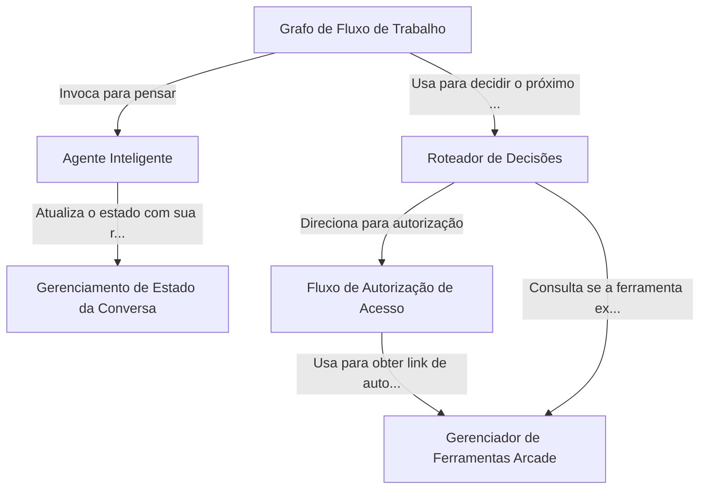

# Tutorial: Arcade Gmail Tool with Auth

Este projeto cria um *assistente inteligente* que entende seus pedidos em linguagem natural, como "resuma meus últimos e-mails". Ele utiliza um **Grafo de Fluxo de Trabalho** para organizar as tarefas de forma lógica, decidindo quando usar *ferramentas* externas para acessar o Gmail e quando pedir sua permissão de acesso. O sistema prioriza a segurança, garantindo que só acessa seus dados após sua autorização explícita, gerenciando toda a conversa para não perder o contexto.

**Source Repository:** [None](None)

## Chapters

1. [Agente Inteligente
](01_agente_inteligente_.md)
2. [Gerenciamento de Estado da Conversa
](02_gerenciamento_de_estado_da_conversa_.md)
3. [Grafo de Fluxo de Trabalho
](03_grafo_de_fluxo_de_trabalho_.md)
4. [Roteador de Decisões
](04_roteador_de_decisões_.md)
5. [Gerenciador de Ferramentas Arcade
](05_gerenciador_de_ferramentas_arcade_.md)
6. [Fluxo de Autorização de Acesso
](06_fluxo_de_autorização_de_acesso_.md)

---

Generated by [AI Codebase Knowledge Builder](https://github.com/The-Pocket/Tutorial-Codebase-Knowledge)