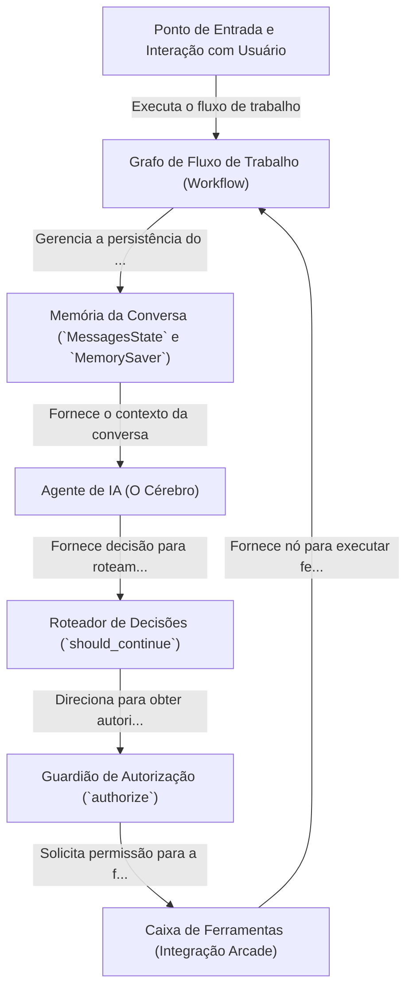

# Tutorial: Chatbot with Arcade Tool and authorization process

Este projeto cria um **chatbot inteligente** que não apenas conversa, mas também pode usar *ferramentas externas*, como fazer uma pesquisa no Google. O sistema é organizado como um *fluxograma* (ou "Grafo"), que decide o que fazer a cada passo. Para garantir a segurança, o chatbot pede sua **autorização** antes de usar ferramentas que acessam suas informações, garantindo uma interação controlada e poderosa.

**Source Repository:** [None](None)

## Chapters

1. [Ponto de Entrada e Interação com Usuário
](01_ponto_de_entrada_e_interação_com_usuário_.md)
2. [Agente de IA (O Cérebro)
](02_agente_de_ia__o_cérebro__.md)
3. [Memória da Conversa (`MessagesState` e `MemorySaver`)
](03_memória_da_conversa___messagesstate__e__memorysaver___.md)
4. [Caixa de Ferramentas (Integração Arcade)
](04_caixa_de_ferramentas__integração_arcade__.md)
5. [Grafo de Fluxo de Trabalho (Workflow)
](05_grafo_de_fluxo_de_trabalho__workflow__.md)
6. [Roteador de Decisões (`should_continue`)
](06_roteador_de_decisões___should_continue___.md)
7. [Guardião de Autorização (`authorize`)
](07_guardião_de_autorização___authorize___.md)

---

Generated by [AI Codebase Knowledge Builder](https://github.com/The-Pocket/Tutorial-Codebase-Knowledge)