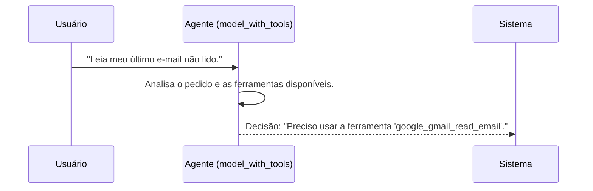

# Chapter 1: Agente Inteligente


Bem-vindo ao primeiro capítulo do nosso tutorial sobre a `Arcade Gmail Tool with Auth`! Nesta jornada, vamos construir passo a passo uma aplicação que consegue entender seus pedidos e interagir com o seu Gmail. Para começar, vamos conhecer o componente mais importante de todos: o cérebro da nossa operação.

Imagine que você pudesse pedir a um assistente: "Encontre o e-mail mais recente do meu chefe e resuma para mim." Como um programa de computador saberia o que "chefe" significa, como acessar seus e-mails e como "resumir" uma mensagem?

É exatamente este o problema que o **Agente Inteligente** resolve. Ele atua como o cérebro da nossa aplicação, interpretando pedidos em linguagem natural (como a que falamos no dia a dia) e decidindo qual a melhor ação a ser tomada.

## O Que é um Agente Inteligente?

Pense no Agente Inteligente como um assistente pessoal muito competente. Ele é construído sobre um **Modelo de Linguagem Grande** (LLM), como o GPT-4o da OpenAI. A sua principal função não é executar tarefas diretamente, mas sim **planejar o próximo passo**.

Quando você faz um pedido, o Agente:
1.  **Entende** o seu objetivo em português.
2.  **Analisa** as ferramentas que ele tem à disposição (como "ler e-mail", "enviar e-mail", etc.).
3.  **Decide** qual ferramenta usar para cumprir o seu pedido.

É essa capacidade de transformar um desejo humano em uma ação executável que o torna tão poderoso.

## Criando Nosso Agente

Para que o nosso agente funcione, precisamos de duas coisas: um "cérebro" (o modelo de linguagem) e "mãos" (as ferramentas que ele pode usar). Vamos ver como configurar isso no nosso código.

Primeiro, nós criamos uma instância do modelo de linguagem. Neste caso, estamos usando o `gpt-4o`.

```python
# Arquivo: src/arcade.py

from langchain_openai import ChatOpenAI

# Cria uma instância do modelo de linguagem (o cérebro)
model = ChatOpenAI(model="gpt-4o")
```

Este código simplesmente inicializa o cérebro do nosso agente. Sozinho, ele é bom em conversar, mas ainda não sabe como interagir com o mundo exterior (como o seu Gmail).

Para isso, precisamos dar a ele ferramentas. Usamos o `ArcadeToolManager` para obter um conjunto de ferramentas prontas, como as de interação com o Google.

```python
# Arquivo: src/arcade.py

from langchain_arcade import ArcadeToolManager
from src.config import ARCADE_API_KEY

# Inicializa o gerenciador e busca as ferramentas do Google
tool_manager = ArcadeToolManager(api_key=ARCADE_API_KEY)
tools = tool_manager.get_tools(toolkits=["Google"])
```

Agora temos um cérebro e uma caixa de ferramentas. O último passo é conectar os dois. Fazemos isso com o método `.bind_tools()`.

```python
# Arquivo: src/arcade.py

# Conecta o cérebro (modelo) às suas mãos e pés (ferramentas)
model_with_tools = model.bind_tools(tools)
```

Pronto! A variável `model_with_tools` agora representa nosso Agente Inteligente completo. Ele não apenas entende a linguagem, mas também "sabe" que possui ferramentas para ler e-mails do Gmail e pode decidir usá-las quando for apropriado.

## Como o Agente "Pensa"?

Vamos espiar por baixo do capô para entender o processo de pensamento do agente. Não se preocupe, é mais simples do que parece!

Imagine que você faz o seguinte pedido ao sistema: `"Leia meu último e-mail não lido."`

O que acontece a seguir?



1.  **Entrada do Usuário:** O sistema recebe sua mensagem.
2.  **Invocação do Agente:** Essa mensagem é enviada para o nosso `model_with_tools`.
3.  **Análise e Decisão:** O agente (GPT-4o) analisa a frase. Ele percebe que a intenção é "ler um e-mail" e verifica sua lista de ferramentas. Ele encontra uma ferramenta chamada `google_gmail_read_email` que parece perfeita para a tarefa.
4.  **Saída do Agente:** O agente **não executa** a ferramenta. Em vez disso, sua resposta é uma instrução para o sistema, dizendo: "Para atender a este pedido, a próxima ação é chamar a ferramenta `google_gmail_read_email`".

Essa separação entre "decidir" e "executar" é fundamental. O agente é o planejador, e outras partes do sistema serão responsáveis por executar o plano.

### O Código por Trás da Decisão

No nosso fluxo de trabalho, a função `call_agent` é a responsável por consultar o agente.

```python
# Arquivo: src/flow.py

from langgraph.graph import MessagesState

# Função que invoca o modelo para obter uma resposta
def call_agent(state: MessagesState):
    # Pega as mensagens da conversa atual
    messages = state["messages"]

    # Envia as mensagens para o agente (modelo com ferramentas)
    response = model_with_tools.invoke(messages)

    # Retorna a resposta do agente para ser adicionada ao histórico
    return {"messages": [response]}
```

Esta função é bastante direta:
- Ela recebe o estado atual da conversa (vamos falar mais sobre isso no próximo capítulo sobre [Gerenciamento de Estado da Conversa](02_gerenciamento_de_estado_da_conversa_.md)).
- A linha `model_with_tools.invoke(messages)` é o momento exato em que perguntamos ao agente: "Dado o nosso histórico de conversa, qual o próximo passo?".
- A `response` conterá a decisão do agente, que pode ser uma resposta direta em texto ou, mais importante, uma instrução para usar uma ferramenta.

### Verificando a Decisão do Agente

Depois que o agente toma uma decisão, outra parte do nosso sistema precisa inspecioná-la para saber o que fazer a seguir. A função `should_continue` faz exatamente isso, agindo como um "roteador".

```python
# Arquivo: src/flow.py

def should_continue(state: MessagesState):
    # Pega a última mensagem (a resposta do nosso agente)
    last_message = state["messages"][-1]

    # Verifica se a resposta do agente foi uma decisão de usar uma ferramenta
    if last_message.tool_calls:
        # ... lógica para decidir o próximo passo ...
        return "tools" # Prossiga para a execução da ferramenta
    
    # Se não, o trabalho está concluído
    return "END"
```

Esta função verifica se a última mensagem (a resposta do nosso agente) contém um `tool_calls`. Se contiver, significa que o agente decidiu usar uma ferramenta, e o sistema é direcionado para a etapa de execução. Caso contrário, significa que a conversa terminou. Veremos mais sobre como essa rota funciona no capítulo sobre o [Roteador de Decisões](04_roteador_de_decisões_.md).

## Conclusão

Neste capítulo, desvendamos o conceito central do nosso projeto: o **Agente Inteligente**. Aprendemos que ele é o cérebro da aplicação, responsável por entender pedidos em linguagem natural e planejar os próximos passos, decidindo qual ferramenta usar. Vimos como inicializar o agente conectando um modelo de linguagem (GPT-4o) a um conjunto de ferramentas do Arcade.

Até agora, nosso agente pode apenas *decidir* o que fazer. Mas como ele mantém o contexto da conversa? Por exemplo, se você disser "leia meu último e-mail" e depois "resuma-o", como ele sabe a qual e-mail "o" se refere?

Isso nos leva diretamente ao nosso próximo tópico. No próximo capítulo, exploraremos como o sistema memoriza o diálogo, um conceito fundamental para conversas mais complexas.

Pronto para continuar? Vamos para o [Capítulo 2: Gerenciamento de Estado da Conversa](02_gerenciamento_de_estado_da_conversa_.md).

---

Generated by [AI Codebase Knowledge Builder](https://github.com/The-Pocket/Tutorial-Codebase-Knowledge)