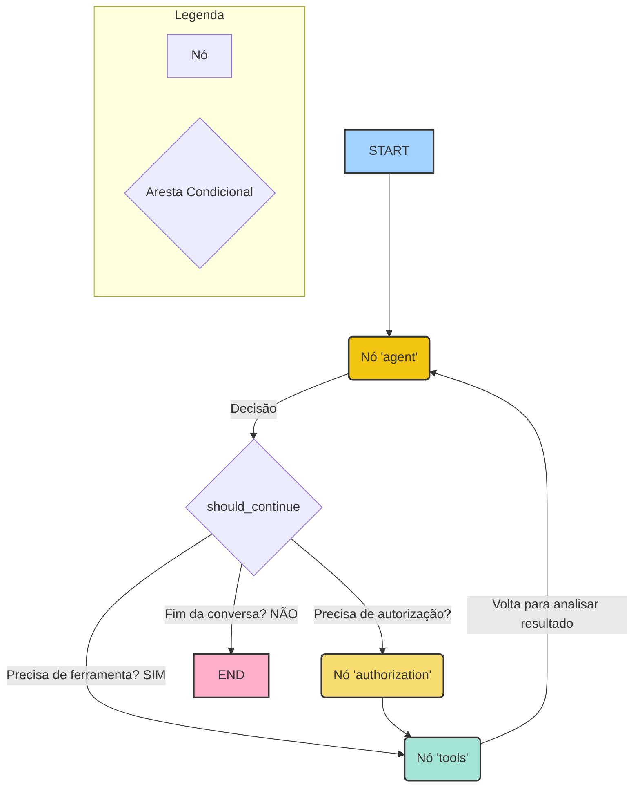

# Chapter 3: Grafo de Fluxo de Trabalho


Nos capítulos anteriores, montamos as peças fundamentais da nossa aplicação: o [Agente Inteligente](01_agente_inteligente_.md), que funciona como o cérebro, e o [Gerenciamento de Estado da Conversa](02_gerenciamento_de_estado_da_conversa_.md), que atua como a memória. Agora, temos um cérebro que pode pensar e uma memória para guardar o contexto. Mas como conectamos tudo isso em uma sequência lógica? Como a aplicação sabe que, depois de pensar, ela deve agir? E depois de agir, deve pensar novamente?

É aqui que entra o **Grafo de Fluxo de Trabalho**. Pense nele como o esqueleto ou o sistema nervoso da nossa aplicação. Ele define o mapa de todas as ações possíveis e como navegar entre elas, garantindo que o pedido do usuário seja processado na ordem correta, passo a passo.

## O Que é um Grafo de Fluxo de Trabalho?

Imagine que você está cozinhando seguindo uma receita. A receita não é apenas uma lista de ingredientes; ela é uma sequência de passos: "1. Preaqueça o forno. 2. Misture os ingredientes secos. 3. Se a mistura estiver homogênea, adicione os ovos. 4. Asse por 30 minutos."

O Grafo de Fluxo de Trabalho é exatamente isso: uma receita para a nossa aplicação. Ele é composto por dois elementos simples:

1.  **Nós (Nodes):** São os passos individuais da receita. Cada "nó" é uma ação, como "chamar o agente para decidir o que fazer" ou "executar a ferramenta de ler e-mails". No nosso código, cada nó é uma função Python.
2.  **Arestas (Edges):** São as setas que conectam os passos. Elas dizem à aplicação: "Depois de terminar o passo A, vá para o passo B".

Juntos, nós e arestas formam um mapa que guia a aplicação do início ao fim.

### O Poder das Decisões: Arestas Condicionais

A parte mais interessante é que as "setas" (arestas) podem ser inteligentes. Em vez de sempre ir do passo A para o B, podemos dizer: "Depois do passo A, faça uma verificação. Se a condição X for verdadeira, vá para o passo B. Se a condição Y for verdadeira, vá para o passo C."

Isso é chamado de **aresta condicional** e é o que permite que nosso fluxo seja dinâmico. Por exemplo:
-   **Agente decide:** "Preciso usar uma ferramenta."
-   **Aresta condicional verifica:** A decisão do agente envolveu uma ferramenta?
    -   **Sim:** Siga para o nó que executa ferramentas.
    -   **Não:** O agente já respondeu ao usuário. Siga para o fim do fluxo.

Essa lógica de roteamento é o coração de um sistema autônomo.

## Construindo o Nosso Grafo

Vamos ver como construímos essa "receita" no nosso código. O processo é muito intuitivo: nós literalmente desenhamos o fluxograma usando código.

Todo o processo acontece no arquivo `main.py`.

### Passo 1: Criar o Esqueleto do Grafo

Primeiro, criamos um `StateGraph`, que é o nosso "quadro branco" onde desenharemos o fluxo. Dizemos a ele que a "memória" que ele vai gerenciar em cada passo é a `MessagesState` que conhecemos no capítulo anterior.

```python
# Arquivo: main.py

from langgraph.graph import StateGraph, MessagesState

# Cria um novo grafo de fluxo de trabalho.
# Ele sabe que vai gerenciar um estado do tipo MessagesState.
workflow = StateGraph(MessagesState)
```

### Passo 2: Adicionar os Passos (Nós)

Agora, adicionamos nossos "passos" ao quadro. Cada passo é um nó com um nome e a função que ele deve executar.

```python
# Arquivo: main.py

# ... (funções call_agent, tool_node, authorize importadas)

# Adiciona o nó "agent": quando ativado, ele chama a função call_agent.
workflow.add_node("agent", call_agent)

# Adiciona o nó "tools": responsável por executar ferramentas.
workflow.add_node("tools", tool_node)

# Adiciona o nó "authorization": para lidar com a autorização.
workflow.add_node("authorization", authorize)
```
Neste momento, temos os passos definidos, mas eles não estão conectados. São como ilhas isoladas.

### Passo 3: Conectar os Passos (Arestas)

Agora, vamos desenhar as "setas" para conectar as ilhas.

Primeiro, definimos o ponto de partida. Todo fluxo começa em algum lugar. Dizemos que, do `START` (início), devemos ir diretamente para o nó `"agent"`.

```python
# Arquivo: main.py
from langgraph.graph import START

# Define a primeira aresta: do ponto inicial, vá para o nó "agent".
workflow.add_edge(START, "agent")
```

Em seguida, definimos o ciclo principal. Após o nó `"tools"` (onde as ferramentas são executadas) terminar, queremos voltar ao `"agent"` para que ele possa analisar os resultados da ferramenta e decidir o próximo passo.

```python
# Arquivo: main.py

# Após executar as ferramentas, volte para o agente.
workflow.add_edge("tools", "agent")
```

### Passo 4: Adicionar a Aresta Condicional (A Lógica)

Esta é a parte mais importante. Após o nó `"agent"` tomar uma decisão, precisamos de uma lógica para decidir para onde ir. Usamos `add_conditional_edges`.

```python
# Arquivo: main.py
from langgraph.graph import END

# Após o nó "agent", chame a função should_continue para decidir o próximo passo.
workflow.add_conditional_edges(
    "agent",
    should_continue,
    ["authorization", "tools", END]
)
```

Isso pode parecer complicado, mas é bem simples de ler:
1.  **Ponto de Partida:** `agent`. A decisão acontece logo após o agente pensar.
2.  **Função de Decisão:** `should_continue`. Essa função (que exploraremos em detalhes no capítulo sobre o [Roteador de Decisões](04_roteador_de_decisões_.md)) irá inspecionar a resposta do agente e retornar uma string: `"authorization"`, `"tools"`, ou `"END"`.
3.  **Destinos Possíveis:** `["authorization", "tools", END]`. O resultado da função `should_continue` determinará para qual desses nós o fluxo irá.

Finalmente, conectamos o nó de autorização ao de ferramentas. Se a autorização for necessária, ela deve acontecer *antes* da execução da ferramenta.

```python
# Arquivo: main.py

# Se o fluxo for para "authorization", o próximo passo deve ser "tools".
workflow.add_edge("authorization", "tools")
```

### Passo 5: Compilar o Grafo

Nosso fluxograma está desenhado! O último passo é "compilar" esse desenho em um objeto executável, conectando-o ao nosso sistema de memória.

```python
# Arquivo: main.py

# Compila o workflow em um grafo executável.
# O checkpointer garante que o estado seja salvo a cada passo.
graph = workflow.compile(checkpointer=memory)
```
Pronto! A variável `graph` agora contém nossa aplicação completa e pronta para ser executada.

## Como o Grafo Funciona na Prática

Vamos visualizar o fluxo completo quando um usuário envia um pedido como "Resuma meu último e-mail".



1.  **Início (`START`):** A execução começa.
2.  **Nó `agent`:** O fluxo vai para o nó `agent`. A função `call_agent` é executada. O agente analisa o pedido e decide: "Preciso usar a ferramenta `google_gmail_read_email`".
3.  **Aresta Condicional (`should_continue`):** O fluxo chega à nossa bifurcação. A função `should_continue` é chamada.
    - Ela olha a decisão do agente e vê que uma ferramenta foi chamada.
    - Ela também verifica se essa ferramenta precisa de autorização. Vamos supor que não.
    - Ela retorna a string `"tools"`.
4.  **Nó `tools`:** O grafo segue o caminho para o nó `tools`. A função `tool_node` é executada, chamando a API do Gmail para ler o e-mail. O resultado (o conteúdo do e-mail) é adicionado ao estado da conversa.
5.  **De volta ao `agent`:** A aresta que definimos (`workflow.add_edge("tools", "agent")`) força o fluxo a voltar para o nó `agent`.
6.  **Nó `agent` (2ª vez):** A função `call_agent` é executada novamente. Desta vez, o [Estado da Conversa](02_gerenciamento_de_estado_da_conversa_.md) contém não apenas o pedido original do usuário, mas também o resultado da ferramenta (o e-mail lido). O agente agora vê tudo isso e decide: "Ok, agora vou resumir este texto". Ele gera uma resposta final em texto.
7.  **Aresta Condicional (`should_continue`) (2ª vez):** A função `should_continue` é chamada de novo.
    - Ela olha a nova resposta do agente e vê que *não* há mais chamadas de ferramenta.
    - Ela retorna a string `"END"`.
8.  **Fim (`END`):** O grafo segue o caminho para o estado final e a execução termina.

## Conclusão

Neste capítulo, construímos o esqueleto da nossa aplicação: o **Grafo de Fluxo de Trabalho**. Aprendemos que ele é um mapa que define todos os passos (nós) e os caminhos entre eles (arestas). Vimos como:

-   Definir cada passo da nossa lógica como um **nó**.
-   Conectar os nós com **arestas** para criar uma sequência.
-   Usar **arestas condicionais** para criar um fluxo inteligente e dinâmico que pode tomar decisões com base no contexto.
-   Criar ciclos (como de `tools` para `agent`) que permitem à aplicação realizar tarefas complexas em múltiplos passos.

Com o esqueleto montado, nossa aplicação já tem uma estrutura sólida. No entanto, a "mágica" da nossa aresta condicional depende de uma função crucial: `should_continue`. Como exatamente ela decide se é hora de chamar uma ferramenta, pedir autorização ou terminar a conversa?

Essa função é tão importante que merece seu próprio capítulo. Vamos mergulhar nela a seguir.

Pronto para entender o cérebro por trás das decisões do nosso grafo? Vamos para o [Capítulo 4: Roteador de Decisões](04_roteador_de_decisões_.md).

---

Generated by [AI Codebase Knowledge Builder](https://github.com/The-Pocket/Tutorial-Codebase-Knowledge)