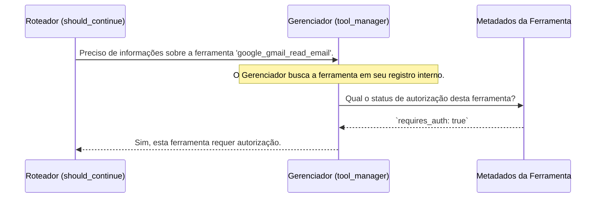

# Chapter 5: Gerenciador de Ferramentas Arcade


No [Capítulo 4: Roteador de Decisões](04_roteador_de_decisões_.md), vimos como nossa aplicação usa a função `should_continue` para direcionar o fluxo de trabalho. Uma de suas decisões mais importantes é se uma ferramenta precisa de autorização antes de ser usada. Mas como ela sabe disso? Como ela sabe que ler um e-mail é uma ação "sensível", mas talvez fazer uma busca na web não seja?

A resposta está no nosso "zelador de ferramentas": o **Gerenciador de Ferramentas Arcade** (`ArcadeToolManager`). Este componente é a caixa de ferramentas central da nossa aplicação. Ele não apenas guarda as ferramentas, mas também sabe tudo sobre elas: o que fazem, como usá-las e, crucialmente, quais são as regras de segurança para cada uma.

## O Canivete Suíço da Nossa Aplicação

Pense no `ArcadeToolManager` como um canivete suíço digital. Ele contém um conjunto de capacidades prontas para uso, como ler e-mails do Gmail, pesquisar na web ou interagir com outras APIs.

Suas principais responsabilidades são:

1.  **Organizar as Ferramentas:** Ele agrupa as ferramentas em "toolkits" lógicos (como o "Google toolkit"), facilitando a escolha das capacidades que queremos dar ao nosso agente.
2.  **Fornecer Descrições Claras:** Para cada ferramenta, ele oferece uma descrição em linguagem natural. É essa descrição que o [Agente Inteligente](01_agente_inteligente_.md) lê para entender o que cada ferramenta faz e decidir qual usar.
3.  **Gerenciar a Segurança:** Ele mantém um registro interno de quais ferramentas acessam dados sensíveis e, portanto, exigem autorização do usuário. É essa informação que ele fornece ao nosso [Roteador de Decisões](04_roteador_de_decisões_.md).

Sem este gerenciador, nosso agente seria como um trabalhador com uma pilha de ferramentas no chão, sem saber qual serve para quê ou qual é perigosa. O `ArcadeToolManager` é o organizador que rotula tudo e coloca avisos de segurança onde necessário.

## Colocando o Gerenciador para Trabalhar

A configuração do nosso gerenciador de ferramentas é feita no arquivo `src/arcade.py`. O processo é direto e focado em equipar nosso agente com as habilidades certas.

**Passo 1: Inicializar o Gerenciador**

Primeiro, criamos uma instância do `ArcadeToolManager`, passando nossa chave de API do Arcade, que o autoriza a buscar as ferramentas disponíveis.

```python
# Arquivo: src/arcade.py

from langchain_arcade import ArcadeToolManager
from src.config import ARCADE_API_KEY

# Inicializa o gerenciador de ferramentas com a nossa chave de API
tool_manager = ArcadeToolManager(api_key=ARCADE_API_KEY)
```
Esta linha cria nosso "zelador", que agora está pronto para nos fornecer as ferramentas de que precisamos.

**Passo 2: Pedir um Conjunto de Ferramentas**

Em seguida, pedimos ao gerenciador um conjunto específico de ferramentas. Em nosso caso, queremos as ferramentas relacionadas ao Google.

```python
# Arquivo: src/arcade.py

# Pede ao gerenciador para nos dar todas as ferramentas do "toolkit" do Google
tools = tool_manager.get_tools(toolkits=["Google"])
```

A variável `tools` agora contém uma lista de objetos. Cada objeto não é apenas o código para executar uma ação, mas também inclui os metadados cruciais: o nome da ferramenta (`google_gmail_read_email`), uma descrição clara para o agente e a informação de segurança.

**Passo 3: Preparar as Ferramentas para o Grafo**

Finalmente, preparamos essas ferramentas para serem usadas dentro do nosso [Grafo de Fluxo de Trabalho](03_grafo_de_fluxo_de_trabalho_.md). Usamos um utilitário chamado `ToolNode`.

```python
# Arquivo: src/arcade.py

from langgraph.prebuilt import ToolNode

# ...

# Envolve nossas ferramentas em um "ToolNode", que sabe como
# executar as ferramentas quando o grafo o chama.
tool_node = ToolNode(tools)
```

O `tool_node` é o que realmente adicionamos ao nosso grafo no `main.py`. Quando o fluxo chega ao nó `"tools"`, é o `tool_node` que recebe a instrução do agente, encontra a ferramenta correta na lista que recebeu do `tool_manager` e a executa.

## Como o Gerenciador Informa sobre Segurança?

A mágica acontece nos bastidores. O `ArcadeToolManager` não apenas entrega as ferramentas, mas também fica disponível para ser consultado. Vamos revisitar a função `should_continue` para ver a colaboração em ação.



O processo é o seguinte:

1.  O [Roteador de Decisões](04_roteador_de_decisões_.md) (`should_continue`) tem o nome de uma ferramenta que o agente quer usar (ex: `google_gmail_read_email`).
2.  Ele chama o método `tool_manager.requires_auth()` com o nome da ferramenta.
3.  O `ArcadeToolManager` consulta seus registros internos (os metadados que vieram com a ferramenta quando ele a buscou).
4.  Ele encontra a propriedade de segurança para aquela ferramenta específica. Por exemplo, a ferramenta `google_gmail_read_email` tem um metadado interno que diz `requires_auth: true`.
5.  O gerenciador retorna `True` para o roteador.
6.  O roteador agora sabe que precisa desviar o fluxo para o nó `"authorization"`.

### O Código por Trás da Consulta

Vamos olhar novamente para a linha específica no `Roteador de Decisões` onde essa consulta acontece.

```python
# Arquivo: src/flow.py

def should_continue(state: MessagesState):
    # ...
    if last_message.tool_calls:
        for tool_call in last_message.tool_calls:
            # AQUI ESTÁ A CHAMADA!
            # O roteador pergunta ao gerenciador se a ferramenta é "sensível".
            if tool_manager.requires_auth(tool_call["name"]):
                return "authorization"
        return "tools"
    # ...
```
Esta única linha, `tool_manager.requires_auth(...)`, é o ponto de contato entre a lógica do nosso fluxo e a inteligência do nosso gerenciador de ferramentas. Ela abstrai toda a complexidade de gerenciar permissões, tornando nosso código de roteamento limpo e focado em sua tarefa: direcionar o tráfego.

Graças a essa arquitetura, se no futuro a Arcade adicionar uma nova ferramenta ao "Google toolkit" que também precise de autorização, nosso código não precisará de nenhuma alteração. O `tool_manager` obterá os novos metadados, e a função `should_continue` continuará funcionando perfeitamente, garantindo a segurança da aplicação.

## Conclusão

Neste capítulo, exploramos a função vital do **Gerenciador de Ferramentas Arcade**. Aprendemos que ele é muito mais do que um simples contêiner de ferramentas. Ele é um componente inteligente que:

-   **Busca e organiza** as capacidades da nossa aplicação.
-   **Descreve** cada ferramenta para que o [Agente Inteligente](01_agente_inteligente_.md) possa tomar decisões informadas.
-   **Atua como um consultor de segurança**, informando ao nosso [Roteador de Decisões](04_roteador_de_decisões_.md) quando uma autorização explícita é necessária.

Com o gerenciador no lugar, nosso sistema sabe *quais* ferramentas usar e *quando* pedir permissão. Mas o que acontece exatamente quando essa permissão é solicitada? Como a aplicação interage com o usuário para obter o consentimento e, em seguida, usa esse consentimento para acessar o Gmail de forma segura?

Essa é a peça final do nosso quebra-cabeça: o processo que lida com o "sim" do usuário. Vamos mergulhar nesse processo no próximo capítulo.

Pronto para desvendar o segredo da autenticação segura? Vamos para o [Capítulo 6: Fluxo de Autorização de Acesso](06_fluxo_de_autorização_de_acesso_.md).

---

Generated by [AI Codebase Knowledge Builder](https://github.com/The-Pocket/Tutorial-Codebase-Knowledge)